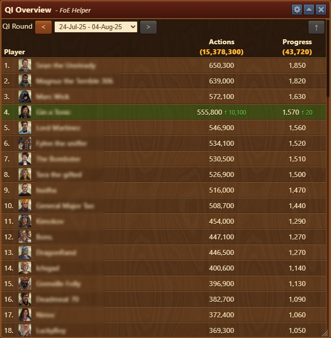
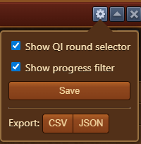

# QI Overview


This module can be activated in [Settings](/en/module/settings/README.md#pop-ups-tab)


The **QI Overview** module displays a leaderboard of guild members' actions and progress in Quantum Incursions during the selected round, helping leaders and players monitor individual and collective efforts.

## Menu Overview

The QI Overview window is structured as follows:

- **Title Bar** with [Configuration](#configuration) menu
- **Round Selector**: Dropdown to select the QI round (date range)
- **⬆**: Progress filter button, filters the list to display only players that had activity since last snapshot.
- **Player List**: Table ranking members by:
  - **Actions**: Total number of actions performed
  - **Progress**: Points contributed to the guild’s overall progress bar


Highlighted rows indicate increases in activity since last snapshot (e.g. `+10,100` actions)


## Configuration

The Configuration interface is structured top-to-bottom as follows:
- **Show QI round selector**: Displays QI round selector in [Menu Overview](#menu-overview)
- **Show progress filter**: Displays **⬆** button in [Menu Overview](#menu-overview)
- **Save**: button for saving checkbox configurations
- **Export**: Allowing you to export data to `CSV` or `JSON` for archiving

## Usage

- Open the in-game Guild Member Ranking window during an active or past QI round.
- QI Overview will automatically open if enabled in [Settings](/en/module/settings/README.md#pop-ups-tab).
- Use the round selector to choose the time frame you wish to analyze.
- Observe color indicators to track recent changes.
- Filter the list via **⬆** to analyze who made progress since last snapshot.
- Data is updated whenever in-game Guild Member Ranking window is opened.

## Use Cases

- Compare activity levels across the guild
- Identify top contributors
- Encourage less active members
- Plan rewards or guild rankings based on participation

## FAQ

**Q: Why I'm missing data from some seasons?** 
A: Data is updated whenever in-game Guild Member Ranking window is opened.

**Q: What are "Actions"?** 
A: Actions refer to Actions spent during Quantum Incursions round.

**Q: What does the green number mean next to some entries?** 
A: It shows the change in contribution since the last snapshot, indicating recent activity.

**Q: Can I filter or sort the list?** 
A: The list is sorted by default based on Progress. Manual sorting may not be available.