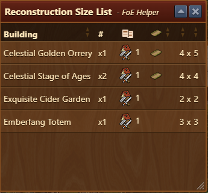

# Reconstruction Size List


This module can be activated in [Settings](../settings/README.md#pop-ups-tab)


The **Reconstruction Size List** module provides a quick overview of buildings in your Reconstruction Mode inventory, showing their dimensions and quantities to help with efficient city planning and layout optimization.

## Menu Overview

The table includes the following columns:

- **Building**: Name of the building stored in Reconstruction Mode.
- **# (Quantity)**: Shows how many instances of each building are available.
- **Icon Indicators**: shows in which menu building is stored (eg. production buildings)
- **Road**: Shows if building requires to be connected by road.
- **Size**: Dimensions of the building (width × height).

## Usage

- Open Reconstruction Mode in-game.
- The module is automatically launched. (if enabled in [Settings](../settings/README.md#pop-ups-tab))
- Use the list to:
    - Compare similar buildings by size to prioritize placement.
    - Sort buildings by size or road requirement.
    - Plan layouts ahead of time, knowing exactly how many and what sizes to reserve.

## FAQ

**Q: How do I access this list?**  
A: By enabling it in [Settings](../settings/README.md#pop-ups-tab) menu is automatically launched when entered in Reconstruction Mode.

**Q: Can I place buildings from this list directly?**  
A: No, this module is informational only. Placement must be done in-game.

**Q: Does it show buildings not yet stored?**  
A: No, it only lists buildings currently stored in Reconstruction Mode.

**Q: What do the icons mean?**  
A: Indicates where the building is stored in in-game menu.