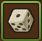
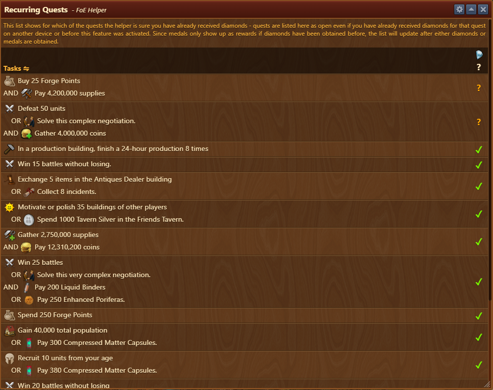
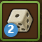

# Recurring Quests Helper

 Recurring Quests Helper displays a list of all recurring quests (RQ's) available for your current era. It assists you in planning and executing quests efficiently to maximize diamond rewards.

## Menu Overview

Menu is structured as follows:

- **Header bar** with [Configuration](#configuration) options
- [**Task List**](#task-list) showing open and completed recurring quests

## Configuration

The configuration menu allows you to display badge counter, for uncollected RQ's, on the menu icon 

## Task List

Recurring quests are presented as structured tasks, with indicators for whether diamonds where collected from specific quest or still available. Each quest may require one or more completions before collecting diamonds.

- **Tasks marked with a checkmark** are completed and diamonds are claimed.
- **Tasks marked with a question mark** indicate ongoing or unclaimed diamonds.

## How to Use

- Clicking on **Tasks** in header menu, list view will change to display Tasks name instead of Tasks requirements.
- Use completion indicators as a to-do checklist to track diamond collection efficiently.
- Monitor the quest list and plan actions that can be accomplished simultaneously (e.g., win battles while gathering coins).
- If a quest provides an alternative completion method (such as battle **OR** negotiation), choose the option that best fits your strategy or available resources.

### Interactive Quest Management

- If you are confident that you've collected diamonds for specific quest on another device, click and hold on a **question mark** in task list for 10 seconds to mark it with **checkmark**.

## FAQ

**Q: Why do some quests appear open even if I have completed them before?** 
A: Recurring quests may appear open if diamonds have already been claimed on another device.The helper tracks quest completion per device.

**Q: My diamonds amount hasn't increased, but some RQ's marked as completed?** 
A: Since medals only show up as rewards if diamonds have been obtained before, the list will update after either diamonds or medals are collected.