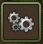

# Settings

This module allows you to manage the general settings of the FOE Helper extension.

## Menu Overview

The Settings module is organized into 4 tabs:

* [**Info + Website**](#info--website-tab) – General information about the assistant
* [**Menu + Notifications**](#menu--notifications-tab) – Opt-in for sending city planner data
* [**Pop Ups**](#pop-ups-tab) – Controls which modules open automatically
* [**Other**](#other-tab) – Appearance and UI layout configuration

## Info + Website Tab

Provides general settings for FOE Helper.

Following options are available:
- **Language**: Change the UI language. Triggers automatic game reload.
- **Website Upload**: Used for uploading Notes and City Planner data to ([foe.helper.com](https://foe-helper.com/))
- **Website Api-Token**: Used for authentication at ([foe.helper.com](https://foe-helper.com/))
- Help: Provides links to official resources:
    * [Foe-Helper.com](https://foe-helper.com/)
    * [Discord](https://discord.com/invite/z97KZq4)
    * [GitHub Issues](https://github.com/mainIine/foe-helfer-extension/issues)
- **About**: Displays various details about the FoE Helper.
- **Version**: Displays following info (Last Change Log, FOE Helper version, Your player ID, Your guild ID, Your current world ID)
- **Load current Beta**: Download the current Beta version of FOE Helper.


Avoid using the Beta version and the standard version simultaneously.


### Translation

You can contribute to translations on [Weblate](http://i18n.foe-helper.com/).

## Menu + Notifications Tab

Controls menu position, sounds, and notification settings.

Following options are available:
- **Menu Position**: Move the FOE Helper menu to:
    * Bottom
    * Right
    * Window (floating)

Based on resolution and zoom, window mode may be applied automatically.

- **Menu Content**: Click to toggle visibility of icons in the FOE Helper menu bar.
- **Menu Length**: Set how many icons are visibile in the menu.
- **Enable Sounds**: Turns on sound effects for supported modules.
- **Rival Sounds**: Turns on sound effects for completed Rival Quest.
- **Expired Buildings Notification**: If turned on, Alerts will be auto created for time limited buildings, to notify when building is decayed.
- **Notifications**: Enable or disable all notifications from FOE Helper.
- **Notification Position**: Choose where notifications appear on screen. After choosing **Preview** notification will pop up.
- **Multiple Notifications**: Control how many notifications can stack at once.

## Pop Ups Tab

Toggles auto-opening of various helper tools during gameplay.

Following options are available:
- **Negotiation Assistant**: Opens the negotiation helper during negotiations (not allowed in GBG).
- **Event Assistants**: Opens various event helpers when an event window is open.
- **Rogue Only Warning**: Shows a notification when only rogues are left in the next wave of a battle.
- **Blue Galaxy Helper**: Opens the [Blue Galaxy Helper](../blue-galaxy/README.md) during BG collection.
- **Ally Overview**: Opens the [Ally Overview](../ally/README.md) when Historical Allies menu is opened.
- **FP Investment Summary**: Opens the [FP Investment Summary](../fp-investments/README.md) when **Town Hall > Contributions to Great Buildings** menu is opened.
- **Guild Treasury Export**: Opens a window to export guild treasury contributions when in-game **Guild Menu > Options > Guild Contributions** is open.

Do not go backward through pages during reading. This may cause duplicate data in export.

- **GbG Building Recommendation**: When province building menu is opened, menu displays a sorted table of more effective building combinations for a GBG province, sorted by their relative impact on the Guild Treasury.
- **Infobox**: Start [Infobox](../infobox/README.md) on game launch.
- **Close All Windows**: Shows a [Close All Windows](../close-all/README.md) on game launch.
- **Scout Info**: Automatically opens the [Scouting info](../scouting/README.md) when in-game Continent Map is opened and scouting is available.
- **Negotiation Blocker**: Blocks negotiation button on the campaign map to prevent unwanted negotiation.
- **Aztecs Mini-Game**: Automatically opens [Aztecs mini-game helper](../aztec/README.md) when Aztec mini game is opened.
- **PvP-Arena-Protocol**: Automatically opens [PvP Arena Overview](../pvp-arena/README.md) when pvp arena is opened.
- **GBG Player list**: Automatically opens [GBG Players Overview](../gbg-players/README.md) when in-game gbg ranking is opened.
- **Rewards bar info**: Enables GBG/GE rewards to be displayed in a stream over rewards bar.
- **QI Player list**: Automatically opens [QI Players Overview](../qi-players/README.md) when in-game QI overview is opened.
- **Army Advice**: Automatically opens [Army Advice](../army-advice/README.md) based on selected parameters.
- **Market Filter**: Automatically opens [Market Filter](../market/README.md) when in-game Market menu is opened.
- **Size list in Reconstruction Mode**: Automatically opens [Reconstruction List](../reconstruction/README.md) when in-game reconstruction mode is opened.

## Other Tab

UI tweaks, advanced features, import/export, and extra helper options.

Following options are available:
- **Box Coordinates**: Resets window positions to center of screen in case they're off-screen.
- **GB Calculator**: Allows using the [GB Calculator](../gb-calculator/README.md) on other players' GBs.
- **Motivatation Activity**: Records data about [motivation/polishing activity](../motivate/README.md).


If disabled, the PO/MO icon is hidden even if enabled elsewhere.


- **Battle Potions**: Activate [Battle Potions](../potions/README.md) module to monitor duration of active boost 

Activating this option might not immediately remove/show the icon - wait or reload.

- **Double donation blocker**: Activate a box to appear over FP entry field agte donation on that GB was made.
- **Auctions**: Enabling automatic calculation of increased bid and copies to clipboard based on selected parameters.
- **2k quest mark**: Activate badge in upper left corner displaying counter of aborted quests 

- **Links**: Adds a link to [foe.scoredb.io](https://foe.scoredb.io) for player profiles and replaces construction kit names with fandom.com links.
- **Helper Battle visibility**: Hides the Helper interface during manual battles (only in "boxed" mode).
- **Import/Export Settings**: Allows you to back up and restore your FOE Helper settings and data via [Import/Export tool](../import-export/README.md). (eg. device change)
- **Repeat Building Selection**: Enable automated selection of last placed building in reconstruction mode, allowing faster buildings placement.

Possibility of triggering INNO's bot detection and causing a short ban period. Please let us know if that happens. [Contact](#info--website-tab)
