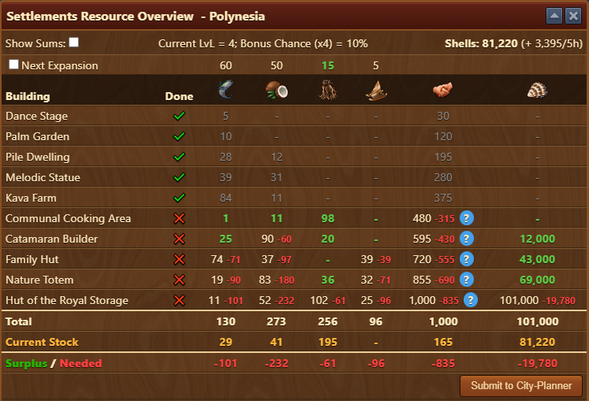
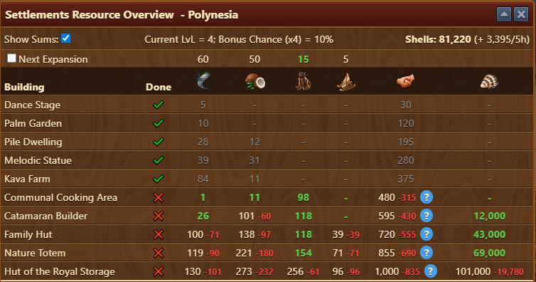
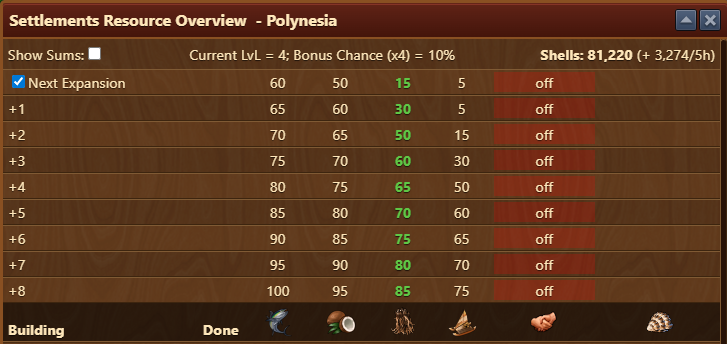

# Cultural Settlement

The Cultural Settlement module gives you a complete overview of what’s required to complete your current settlement. It helps you track goods, diplomacy, expansion progress, and even connects to the City Planner.

## Menu Overview

The module consists of following:

- **Top Menu**:
    - [**Show Sums**](#show-sums) Toggle the building requirements display
    - **Current LvL** Displays current run of settlement
    - **Bonus Chance** Displays bonus chance for x4 goods collection (depending on Current LvL)
    - **Currency** Total amount of available currency, and current production (eg. Shells)
- [**Expansion Cost Overview**](#expansion-overview-top-table) next expansion cost
- [**Building Requirements**](#building-requirements-bottom-table)
- [**Totals**](#totals-bottom-summary)
- [**Submit to City Planner**](#city-planner-integration) Button

### Building Requirements (Middle Table)

- **Building** All unlockable buildings for the settlement.
- **Done** Shows ✓ or ✗ to indicate if the building has been unlocked.
- **Goods columns** Required goods for unlocking each building.
- **Diplomacy** Required diplomacy for unlocking each building.

**Blue (?) icons** Hoverable help icons that explain how to gain the missing diplomacy if applicable.

- **Green numbers** Indicates surplus resources.
- **Red numbers** Indicates a deficit (needed resources).

### Totals (Bottom Summary)

- **Total**: Sum of all goods needed to unlock remaining buildings.
- **Current Stock**: How many of each good you currently have.
- **Surplus / Needed**: Shows shortfall or excess for each good in red or green respectively.

### Show Sums

If **Show Sums** is selected, goods requirements calculation will display cumulative amount needed and shortfall or excess per good type. 

### Expansion Overview (Top Table)

If **Next Expansion** is selected, table will expand to display costs of future expansions per good type of choice.

- **Next Expansion**: Shows the cost of unlocking the next available expansion.
- **Future Expansions (+1 to +8)**: Lists costs for all upcoming expansions.
- **Goods Required**: Columns for each cultural good.
- **"off" Column**: Shows whether the specific expansion bonus is active or not.
- **Bonus Info**: Displays current building level and active bonus chance (e.g., 10%).

### City Planner Integration

Click **Submit to City Planner** to send your current settlement layout and data to the FOE Helper City Planner website.

Once submitted, you’ll find it under the **"New City"** tab on [foe-helper website](https://foe-helper.com/citymap), detailed info on page [City Planner](/en/website/citymap/README.md)

## Features

- Helps calculate **exact shortfalls** before you commit to unlocks.
- Indicates **which resources you’re missing** (and by how much).
- Offers **diplomacy assistance** for buildings where you’re below the required amount.
- Direct export to layout planning tool (City Planner).

## FAQ

**Q: What does the “off” label in the expansion row mean?** 
A: It indicates whether a specific expansion’s bonus chance is currently activated or not.

**Q: What does the blue “?” icon do?** 
A: Hovering it will show how to meet the missing diplomacy requirement for a building.

**Q: What happens after I click “Submit to City-Planner”?** 
A: Your current settlement plan is uploaded and accessible under the **New City** section on the City Planner website.