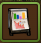
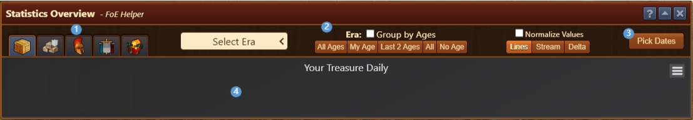
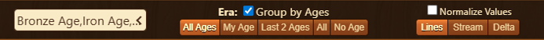
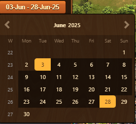
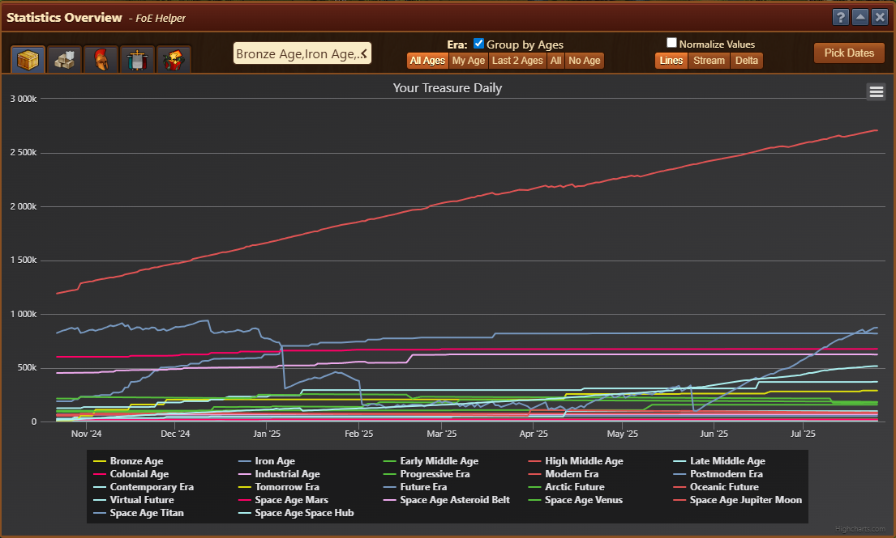
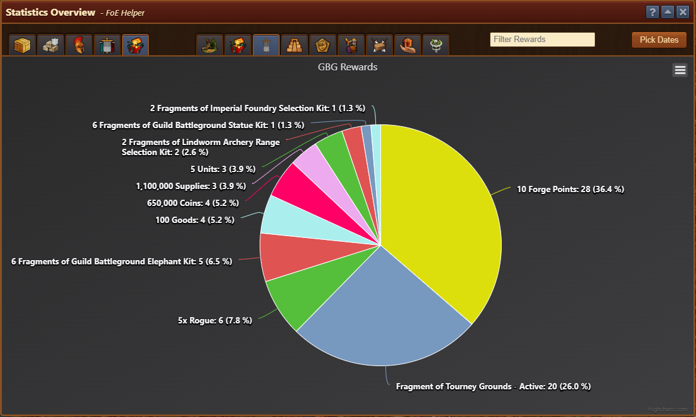
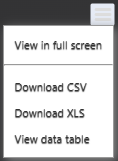

# Statistics Overview

The Statistics Overview module provides detailed visualizations of your in-game data over time. It helps track the type and frequency of rewards you’ve received.

## Menu Overview

The Statistics Overview features multiple tabs, each dedicated to a specific category, showing the details for each group:

1. [**Tabs**](#tabs):
    - Your Treasure Daily
    - Guild Treasury Daily
    - Units Daily
    - GbG Players Scoreboard
    - Rewards
2. [**Filters and Options**](#filters-and-options) for chart customization
3. [**Calendar**](#calendar) for selecting observed period
4. [**Chart Display**](#chart-display)
    - [Chart Options menu](#chart-options-menu)

## Tabs

Tabs can be divided in three groups:
- Resources: Visualizing available resources over time (eg. Resources, Guild Goods, Units)
- GbG players performance: Visualizing players performance in GbG over time
- Rewards: Visualizing rewards gathered over time (eg. from incidents, GbG, etc.)

> Selecting **Rewards** tab, displays additional tabs for selecting overview per source of rewards (eg. Incidents, Events, GbG, GE, QI, PvP Arena, Himeji Castle, Space Carrier, Flying Island)

## **Filters and Options:**

Available on tabs representing **Resources** data

- **Era**: Dropdown for selecting specific eras to focus on (e.g., Iron Age, Oceanic Future).
- **Group by Ages**: Toggles grouping of goods by era for easier overview if multiple eras analyzed.
- **Preset buttons**: Quickly select common era filters instead of using the dropdown manually.
    - All Ages: Includes all eras goods
    - My Age: Includes players era goods
    - Last 2 Ages: Includes current and previous era goods
    - All: Includes all eras goods, special goods, and No era goods
    - No Age: Includes resources not related to era (eg. Diamonds, Coins, Supplies, Tavern Silver, Medals, QI Medals)
- **Normalize values**: Toggle to visually scale values for comparison.
- **View modes**:
  - Lines: Trend lines for each type.
  - Stream: Flow-style visualization.
  - Delta: Emphasizes daily changes. (eg. growth above x axis, loss below x axis)

## Calendar

Calendar feature is available on all tabs, and it enables setting a custom date range to narrow or expand the analysis by selecting start and end date of analyzed period.

## Chart Display

Charts can be divided in two groups:
- [Resources Chart](#resources-chart)
- [Rewards Chart](#rewards-chart)

### Resources Chart

Available for **Resources** and **GbG** [tabs](#tabs)

- 3 different versions chosen via [Options](#filters-and-options) **view modes**
- Displays a graph of resources, amount categorized by era/type.
- Helps analyze daily changes and long-term trends.
- Allows visual comparison between different eras/types.
- The vertical axis shows the amount.
- The horizontal axis represents time, with data points typically captured daily.

### Rewards Chart

Available for **Rewards** [tabs](#tabs), visualized as pie chart summarizing the **distribution of rewards** received over selected period. Each slice represents a specific reward type and its frequency percentage.

- Visual breakdown of all rewards collected from chosen source, such as:
  - Forge Points
  - Fragments of special kits
  - Units and goods
  - Coins and supplies
- Shows the total count and percentage for each reward type.
- Useful to understand what rewards you’re most likely to earn over time.
- Can be filtered and time-ranged like other tabs using the same interface (date picker, filters, etc.).

### Chart Options menu

Located in the top-right corner of each chart, this menu provides additional functionality for interacting with the visualized data.

- **View in Full Screen**: Expands the chart to occupy the full screen for better readability and detailed inspection.
- **Download to Excel or CSV**: Exports the current chart’s data into .xlsx or .csv (Excel-compatible) formats. Useful for archiving or performing further analysis.
- **View Data Table**: Displays a structured table of the raw data used in the chart directly below it. This view helps examine precise values and compare entries without interpreting visual lines or pie segments

## Usage

- Use this module to analyze long-term patterns in resources gains/losses and optimize production accordingly.
- Reward statistics help track the effectiveness and return on your in-game activities.
- This module helps guild leadership and individual players make informed decisions based on historical data.

## FAQ

**Q: Why are some rewards so common?** 
A: The system reflects designed chances for specific rewards, collected data volume and your personal luck. Some rewards like Forge Points are designed to be more frequent.

**Q: Can I export this data?** 
A: Yes directly from chart, more details at [Chart Options Menu](#chart-options-menu).

**Q: Why do some ages have sharp drops in the line chart?** 
A: That usually happens due to a change in player activity, or building adjustments.