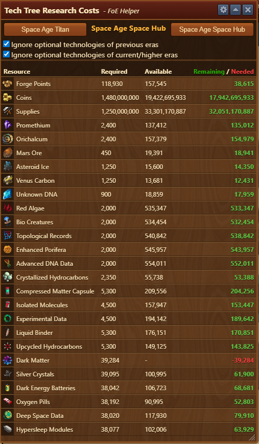
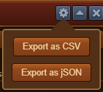

# Technology Tree

The **Technology Tree** module displays the total amount of resources needed to unlock all technologies up to a selected era. It is especially useful for planning resource needs across multiple future eras.


You must open the in-game Technology Tree in Forge of Empires before launching this module for data to load correctly.


## Menu Overview

The layout of the Technology Tree module is composed of:

- A title bar with the [Configuration menu](#configuration)
- [Era Selection and Options](#era-selection-and-options)
- [Resource Requirements Display](#resource-requirements-display)

## Configuration

The configuration menu allows you to:

- Export the cumulative resource requirements to a `.csv` or `.json` file.
- Useful for planning outside the game or sharing with others.

## Era Selection and Options

This zone lets you control which era’s requirements are displayed:

- **Left button**: Go to the previous era  
- **Right button**: Advance to the next era  
- **Central label**: Displays the currently selected era  

Checkboxes allow fine-tuning:

- **Ignore optional technologies of previous eras**: Excludes optional techs, of your in-game previous eras, from the total calculation
- **Ignore optional technologies of current/higher eras**: Excludes optional techs,of your in-game current/higher era, from the total calculation

## Resource Requirements Display

This section shows all required goods to unlock technologies:

- **Red numbers**: highlight missing goods
- **Green numbers**: surplus goods
- Totals include:
  - Costs from previous eras if progressing linearly
  - Full cumulative cost when advancing to future eras


This module improves on the native FoE tech tree overview by showing total cumulative needs to reach selected era, not just for the specific era, helping you plan long-term.


## Usage

- Plan resource investments before entering a new era
- Anticipate potential shortages ahead of time
- Export requirements for guild sharing, tracking, or personal optimization

## FAQ

**Q: Why do I see goods from earlier eras?** 
A: If advancing multiple eras ahead, the module includes goods needed from all intermediate eras unless filtered out using checkboxes.

**Q: Do these totals match what I see in the in-game tree?** 
A: Not exactly, this module aggregates **all cumulative costs**, including optional technologies if not excluded manually.

**Q: Can I save this data?** 
A: Yes, use the Configuration menu to export in `.csv` or `.json` format.
