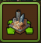
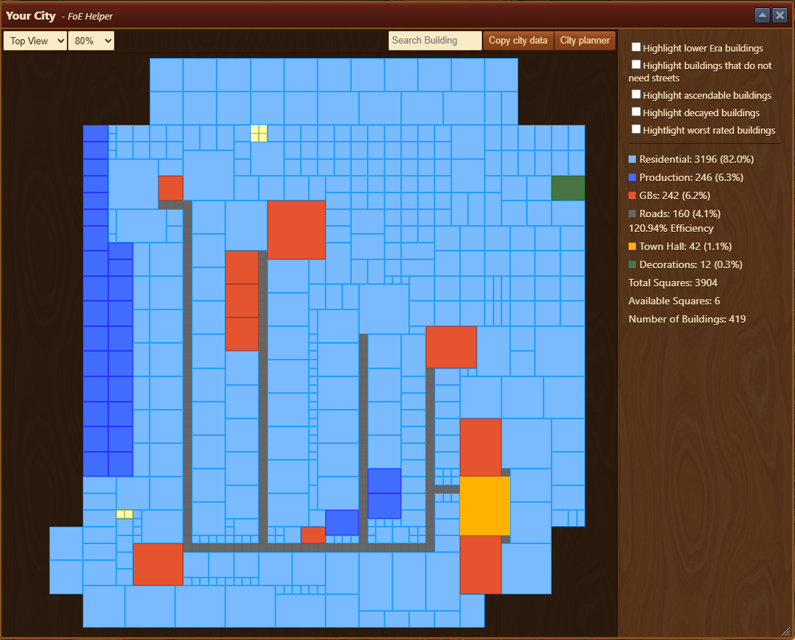
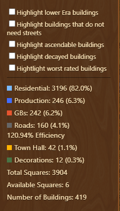
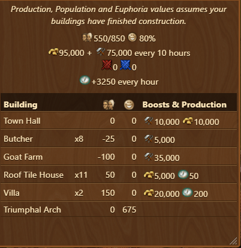

# Town Overview

The **Town Overview** module displays a map of your city layout and allows exporting that layout to [foe-helper.com](https://foe-helper.com) for further planning.

## Menu Overview

The **Town Overview** is structured from top to bottom as follows:
- [**Header Menu**](#header-menu)
- **City Map Display**: Click and drag to reposition the map within the window
- [**Side Menu**](#side-menu)

## Header Menu

Header menu enables you to:
- **Change View**: Toggle between **Isometric View** (as in-game) and **Standard Grid View**
- **Zoom in and out**: dropdown to inspect specific areas
- [**Search Building**](#search-for-buildings) (available only in main city)
- [**Copy city data**](#copy-city-layout-data) (available only in main city)
- [**City planner**](#export-to-website) (available in main city and [Settlements module](/en/module/settlements/README.md#city-planner-integration))

### Search for Buildings

- Use the **Search field** to find a specific building
- The building’s surface will blink to visually indicate its location

### Copy City Layout Data

- Copies the current layout to your clipboard in **JSON** format
- Useful for storing, editing, or exporting data outside the game

### Export to Website

- Sends your current city layout to the [foe-helper.com city planner](https://foe-helper.com/citymap/overview)
- A confirmation popup appears before the transfer


The use of the planner on the website is described in [City Planner Guide](/en/website/citymap/README.md)


## Side Menu

Side menu updates data based on current in-game active map:
- [**Main City**](#main-city-side-menu)
- [**Quantum Incursions**](#quantum-incursions-side-menu)

### Main City Side Menu

Checkboxes allow you to quickly highlight specific buildings:
- **Highlight lower era buildings** and displays number of buildings per lower era
- **Highlight buildings that do not need streets** to purple color
- **Highlight ascendable buildings** to orange color
- **Highlight decayed buildings** that where previously ascended (eg. Forgotten Temple)
- **Highlight worst rated buildings** based on the [Building Efficiency Module](/en/module/efficiency/README.md)

The legend shows color coding, building classification, the number of squares each consumes, and their percentage share in the overall city layout.


Hi, would this claim be correct "Road efficiency is calculated by dividing **half the minimum required number** of road tiles (assuming each building connects along its shortest side, and two buildings share a road) by the **actual number of road tiles used**." 
Road efficiency = (minimum required road tiles ÷ 2) ÷ actual road tiles used


### Quantum Incursions Side Menu

Quantum Incursions Side Menu displays summary of QI resources and boosts produced in QI settlement.

## Usage Tips

- Use highlighting to identify and replace old buildings
- Use highlighting to identify which buildings can be detached from roads
- Use highlighting of decayed and ascendable buildings to check if there is any decayed which can't be ascended (eg. permanently decayed)
- Access foe-helper.com to simulate city reorganizations with ease

## FAQ

**Q: Can I edit my city in this module?**   
A: No, editing is done after exporting to the website planner.

**Q: Can FoE Helper rearrange my city based on import from other tool?**   
A: No, in-game rearranging must be done manually.

**Q: Does this show building bonuses or stats?**  
A: Only in QI map. Bonuses for main city are shown in other modules.
