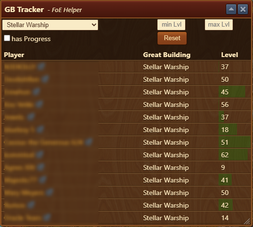

# Great Building Search

The **Great Building Search** module helps you find a specific GB across your **friends**, **neighbors**, or **guildmates** so you can easily invest Forge Points or find BP's.

## Menu Overview

The window consists of:

- A **dropdown list** to select the GB you want to search for (only one GB at a time).
- Optional filters:
  - **Minimum and maximum level** to narrow the search.
  - **In Progress** checkbox to record only GBs with Forge Points already placed.

## Usage

1. Open the **Great Building Search** module window.
2. Use the **social bar** or the **ranking list** to visit other players.
3. For each player, **open their GB list**:
4. As you browse, the helper **automatically tracks** and lists any matches based on your criteria.

5. The **progress bar** indicates how filled a GB is (green bar shows % of Forge Points already invested)
6. Use the **reset button** to clear results and start a new search.

## FAQ

**Q: Do I need to keep the module open during visits?** 
A: Yes, the module must be open while browsing player GBs to track matches.

**Q: Can I search for more than one GB at once?** 
A: No, only one GB at a time can be tracked.

**Q: Does this show if a GB is locked?** 
A: No, it only shows Forge Point progress and matched criteria.