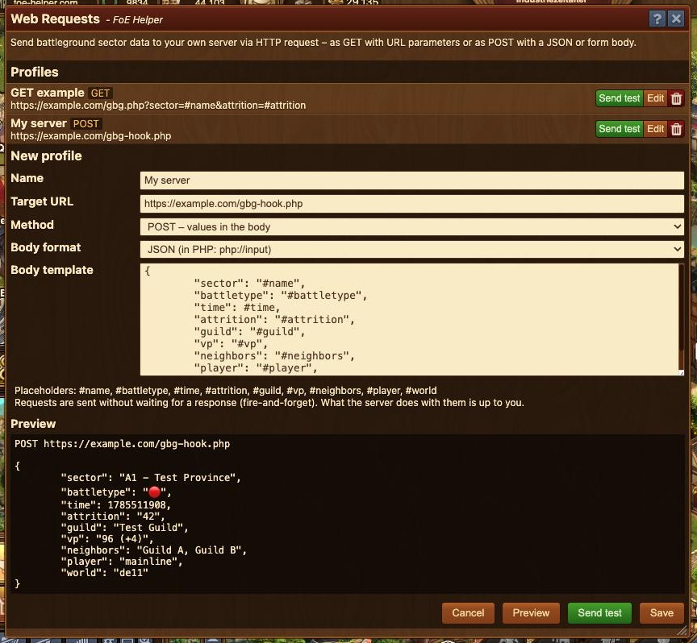

# Web Requests

This module sends Guild Battleground sector data via HTTP request to your **own server** — no Discord needed. Perfect for tinkerers who want to process notifications themselves (custom bots, dashboards, push services, home automation, …).




Requests are **fire-and-forget**: the helper sends the request and does not wait for a response. What your server does with the data is up to you.


## Creating a profile

Open the module from the menu and create a new profile:

| Field | Meaning |
| --- | --- |
| **Name** | Freely chosen, shows up later in the Guild Battleground settings |
| **Target URL** | Your server address. Placeholders are allowed directly in the URL |
| **Method** | `GET` (values as URL parameters) or `POST` (values in the body) |
| **Body format** | POST only: `JSON` or `Form data` |
| **Body template** | POST only: the request content, with placeholders |

## Placeholders

When sending, the placeholders are replaced with the sector data:

| Placeholder | Content |
| --- | --- |
| `#name` | Sector name |
| `#battletype` | 🔴 attack / 🔵 defense |
| `#time` | Unix timestamp of the unlock (seconds) |
| `#attrition` | Attrition chance in percent |
| `#guild` | Guild owning the sector |
| `#vp` | Victory points (incl. bonus) |
| `#neighbors` | Adjacent guilds |
| `#player` | Your player name |
| `#world` | Your game world |

With `GET` the values are URL-encoded automatically, with `JSON` they are escaped correctly — nothing to worry about.

## Preview and test

The **preview** in the form shows the final request with sample data — including a warning if your JSON template does not produce valid JSON. **Send test** fires the request with the sample data right away so you can debug your script directly.

## Receiving the data on your server

**GET — values as URL parameters:**

Target URL: `https://example.com/gbg.php?sector=#name&attrition=#attrition`

```php
<?php
$sector    = $_GET['sector'] ?? '';
$attrition = $_GET['attrition'] ?? '';
```

**POST — form data:**

The body template contains one `key=value` pair per line and is sent as `application/x-www-form-urlencoded`:

```php
<?php
$sector = $_POST['sector'] ?? '';
```

**POST — JSON:**

The body is sent as text and does not end up in `$_POST`; read it like this:

```php
<?php
$data = json_decode(file_get_contents('php://input'), true);
$sector = $data['sector'] ?? '';
```

## Technical notes

* Only `https://` URLs are possible (or `http://localhost` for development). Other `http://` targets are blocked by the browser as mixed content.
* Your server needs **no CORS configuration** — the response is never evaluated.
* Custom HTTP headers (e.g. `Authorization`) are technically not possible. If you need protection, simply pass a secret as a URL parameter or body field, e.g. `&token=my-secret`.

## Guild Battlegrounds

Select your profile in the settings of the GBG player overview (gear icon, "Web Requests" section). Every sector then gets a send button next to the Discord buttons, and via the row selection you can send several sectors at once — one request per sector.
