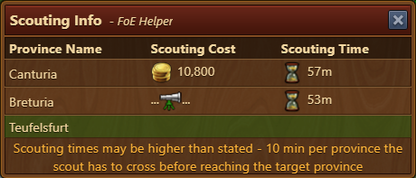

# Scouting Info

This module shows you the current status of your scout when you enter the map - no matter which map you and the scout are currently on. Farming your exploration sites (from space age mars) will no longer distract you from scouting.

## Layout

The Scouting Info shows the following information:

* How much it costs to scout a certain province and how long it will take (row one in above table).
* Which province the scout is currently heading to and how long this will take (row two in bove table - updates only when opening the map)
* Which provinces can currently be conquered (green background - e.g. third row in above table)

## Config

The module may be (de)activated in the settings of the extension.