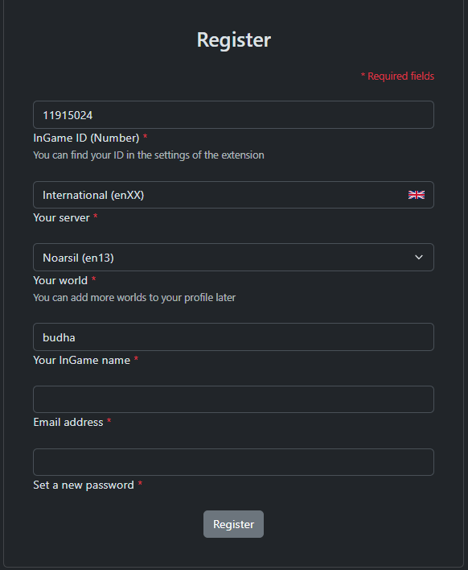

To use the FOE Helper extension features fully, you'll need to register an account on Foe Helper website.

# Register account

To register your account, you should go to the following web page: [Register account](https://foe-helper.com/register/player)

The form for account creation has the following required fields:

| Field               | Description |
|---------------------|-------------|
| **InGame ID**       | A numeric ID from the FOE Helper extension. You can find it in FoE Helper extension settings. |
| **Your server**     | Select your FoE server. You can find it in FoE Helper extension settings. The two-letter code at the beginning of "World" indicates your server (e.g., "EN" for the International server). |
| **Your world**      | Choose the world you play in. You can find it in FoE Helper extension settings. |
| **Your InGame name**| Your in-game Forge of Empires username. |
| **Email address**   | A valid email address to associate with your account. |
| **Set a new password** | Choose a secure password to protect your account. |

You can find the needed info in the FoE Helper browser extension by going to **Settings → Version**

## Filled form example

## Tips

- Don't use Forge of Empires account password.
- Use a **strong password** (at least 8 characters recommended).
- You can add more worlds after registration in your profile settings.
