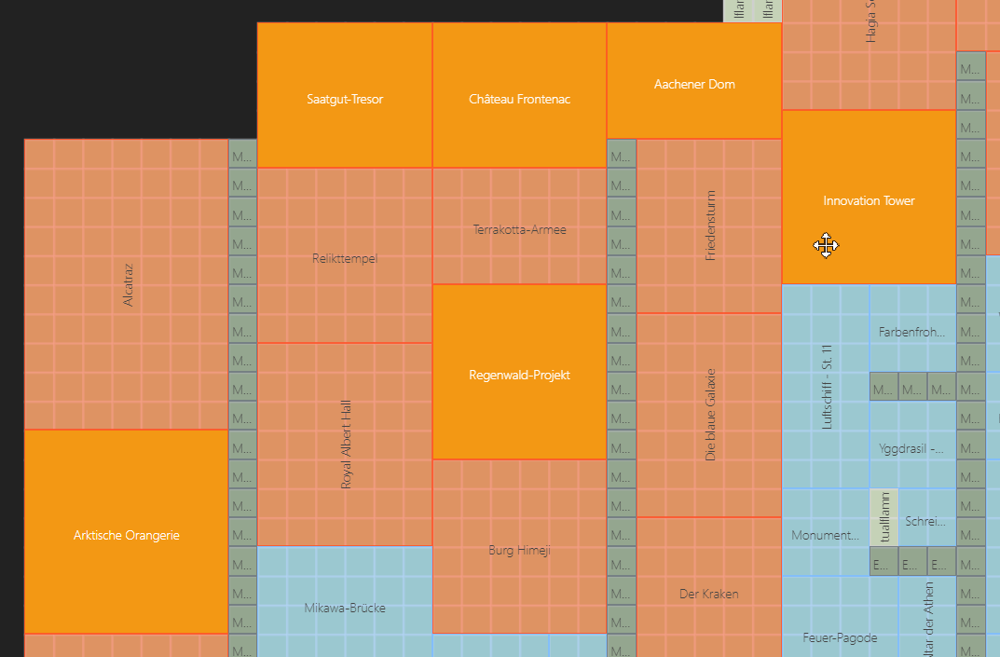
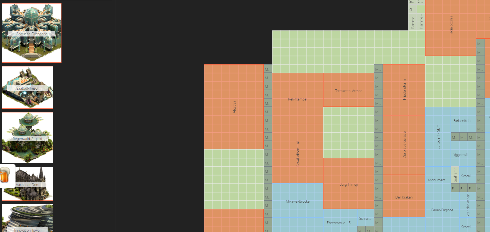
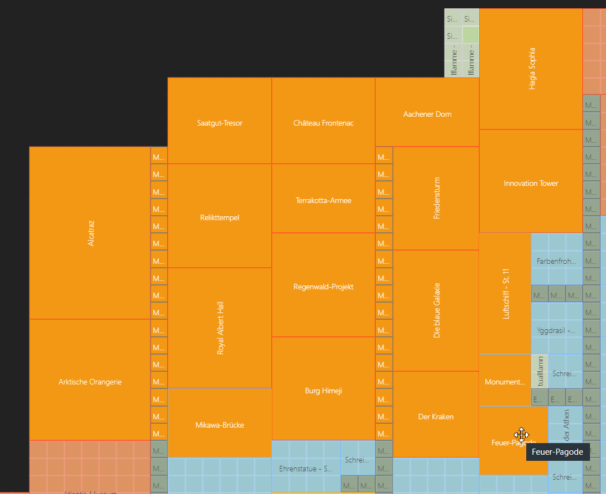
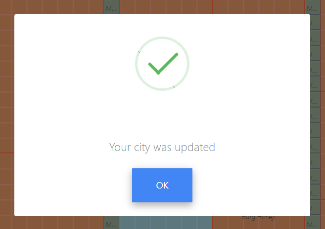
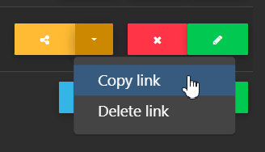

# City planner

## What can this tool do?
To plan different variants of a city or to have a guild colleague or friend plan the city, this tool is just the right thing. 
You can pass on a share link, which enables the editor to plan your city.

## Overview

You can access the city planner at the top of the website via the "Tools" menu:

Your cities appear in the overview. Your capital, but also all your outposts if you have uploaded and saved them here:

## Edit city

Click on "New city" to see which data is available.
are available. You must have sent this data from the FoE helper extension to this server. 
This will usually be your city itself and/or the last outpost you sent.

All buildings are always on the map when you first call them up. Your city is also built like this.

---

Click on "Remove buildings" to move all buildings on the map to the left in the site bar.

---

You can also mark individual buildings with CTRL + left mouse button...

... and move it to the sidebar with the "Del" key.

With Shift + left mouse button you can draw a square, starting outside the map, over the buildings that you want to send to the sidebar with the "Del" key:

All buildings that touch the orange square are taken into account. The building does not have to lie completely within it.

With these aids, you don't have to push every single building to the left. Which of course also works.

---

There are two options for saving. The first time you save, you will be asked for a name. 
If you have saved successfully, your city will be saved automatically in the background every 30 seconds.

If you open an existing city, it is immediately saved in the background every 30 seconds after opening. So no progress is lost.

---

If you do not have more monitors, YOU can save your city either as a graphic or as a transparent PNG graphic. 
You do this with the buttons "PDF Download" or "PNG Download".

## Share city

If you want someone else to plan your city for you, you can create a "Share Link" in the overview.:

---

Click on copy to copy it to the clipboard of your device.:

If you delete the share link, the city cannot be called up again under this link. You have to create a new one and share it again.

