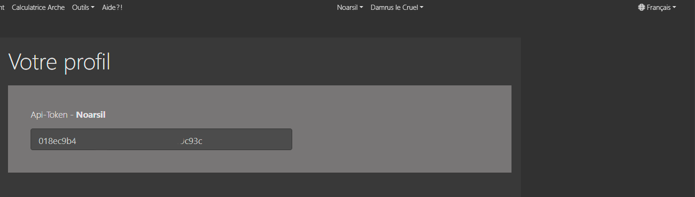

# Jeton API

## Recevoir le Jeton
Afin d'envoyer des données de l'extension à foe-helper.com, vous avez besoin d'un jeton API gratuit.
Vous pouvez facilement copier ceci depuis votre profil.

Veuillez noter que chaque monde nécessite son propre jeton. Vous avez donc besoin de votre propre jeton pour FR1, FR2 ou FR12..

## Déposer le jeton

Vous pouvez désormais simplement stocker le jeton copié à partir du profil dans l'extension du monde approprié.

![Jeton API] (./.images/Jeton_Extension.png)

Encore une fois, faites attention à la sélection du bon monde !

