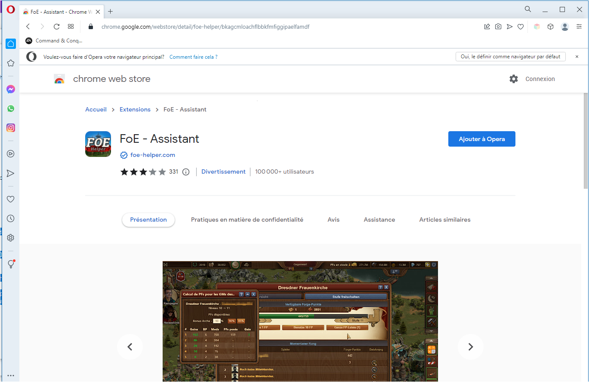
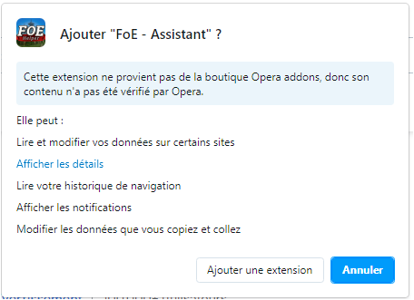

# Extension FoE Assistant 

L'assistant FoE est une extension de navigateur qui « recouvre » le jeu et peut évaluer les données envoyées par le jeu à votre navigateur.

Étant donné qu'aucune donnée n'est manipulée, qu'aucune action n'est automatisée ou que d'autres modifications sont apportées, cette extension n'est pas officiellement approuvée par InnoGames, mais elle ne viole pas les règles du jeu et est donc tolérée.

## Installation de FoE-Assistant

L'assistant FoE convient à tous les navigateurs basés sur Chromium.

Ce sont les plus connus : [Google Chrome](https://www.google.com/chrome/), Microsoft Edge, [Opera](https://www.opera.com/) [(GX)](https : //www.opera.com/fr/gx), [Vivaldi](https://vivaldi.com/), [Brave](https://brave.com/), [Blisk](https:// blisk.io/), [Colibri](https://colibri.opqr.co/), [Navigateur Epic](https://www.epicbrowser.com/), [Navigateur Iron ou SW](https:// www.srware.net/iron/), et bien plus encore.

De plus, Firefox est également pris en charge en tant que variante non Chromium.

Il existe une version dans la boutique d'extention pour Chrome, Microsoft et Firefox. Il existe une petite solution de contournement pour Opera et éventuellement d'autres navigateurs à base de chrome.

## Chrome Installation

Accédez à la boutique en ligne Chrome : [Chrome Store](https://chrome.google.com/webstore/detail/foe-helper/bkagcmloachflbbkfmfiggipaelfamdf) et cliquez sur le bouton "Ajouter à Chrome" en haut à droite.

L'extension sera automatiquement ajoutée à votre navigateur après votre confirmation.

Si vous avez déjà ouvert le jeu dans un de vos onglets, il faut recharger la fenêtre !

Après avoir ouvert le jeu, une barre supplémentaire apparaît en bas à droite.

## Microsoft Edge

Semblable à Chrome, l'extension peut simplement être téléchargée et installée à partir du [Microsoft Store](https://microsoftedge.microsoft.com/addons/detail/foe-helfer/cpmacpalonncbafboibpcjcpadloannb).

L'installation à partir d'ici est la même qu'avec Chrome.

## Opera Browser

german

Avec un petit outil, n'importe quelle extension Chrome peut être facilement installée dans un navigateur Opera. Cela peut également s'appliquer à tous les autres navigateurs basés sur Chromium. Cela diffère d'un cas à l'autre.

1. Ouvrez [Opera Store](https://addons.opera.com/de/extensions/details/install-chrome-extensions/) dans votre navigateur Opera (PC) et installez-le.
2. Redémarrez votre opéra.
3. Ouvrez le Chrome Webstore dans votre Opera et ajoutez comme décrit sous "Installation de Chrome" 
4. Confirmez le mode de compatibilité : 
5. L'extension s'installe toute seule
6. Redémarrez le navigateur et profitez du jeu avec l'aide.