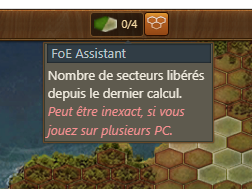
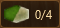
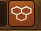
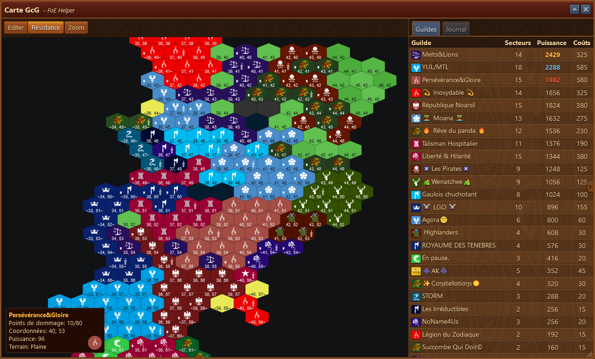
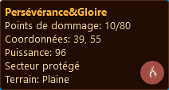
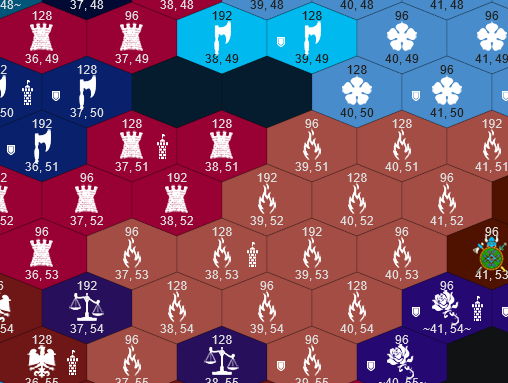
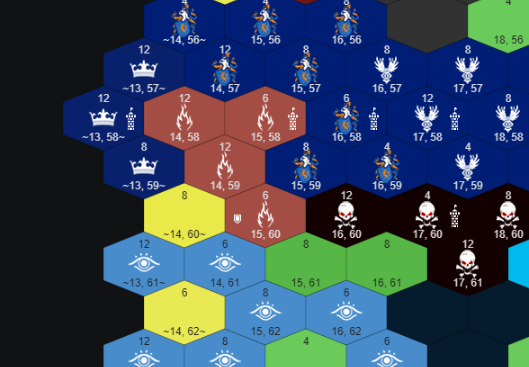
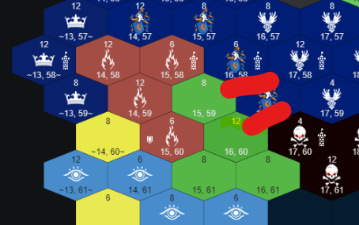

# GcG - Guilde contre Guilde

 

Ce module affiche les secteurs en GcG avec leur force et leur état.

## Structure

Cette fenêtre a deux parties :

 affiche les nombres de secteurs que vous avez libéré sur 4. 


N'affiche que les secteurs libéré sur le présent ordinateur. Si vous avez libéré des secteurs avec un autre PC ou un autre navigateur, alors ils ne seront pas affiché. Par contre, FoE ne vous laissera pas libérer plus de 4 secteurs.


 permet d'ouvrir la carte des secteurs de l'ère en cours ou de la dernière carte visitée si vous êtes sur la page des continents.

## Utilisation

La carte principale affiche les coordonées de chaque secteur avec son propriétaire et un petit bouclier si le secteur est protégé.
Les secteurs jaune (sans logo) sont des secteurs débarquables.
Les secteurs vert (sans logo) sont des secteurs libre tenu par un PNJ.

en cliquant sur un secteur, le détail du secteur est affiché dans une fenêtre sur le bas

### Classement et journal

sur la droite, il a deux onglets :

**Guilde** : Le classement des guildes avec le nombre de secteur, la puissance acquise et le cout par ressource pour le prochain secteur. 
**Journal** : Affiche les actions effectuée sur le secteur et entre autre : qui a posé le siège, tapé sur le secteur et fini le secteur.

La partie droite peut-être affichée ou cachée au moyen de 

### Zoom

Le bouton  permet d'agrandir l'affichage de la carte et de voir les points rapporté par chaque secteur.
Le secteur qui a le QG est aussi affublé d'une tour symbolique pour marquer son emplacement.

en cliquant-tenant sur la carte, vous pouvez déplacer la carte dans la fenêtre pour afficher d'autres portions.

### Edition

Le bouton  sert à marquer des secteurs sur la carte.

 
on indique que les 2 secteurs (fléché rouge) devront être libéré à 20h par exemple ou attaqué.

La carte peut être copiée ou sauvegardée au moyen d'un clic droite et ensuite collé dans un serveur Discord par exemple.

### Résistance

Le bouton  est pour le moment inactif.
