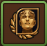
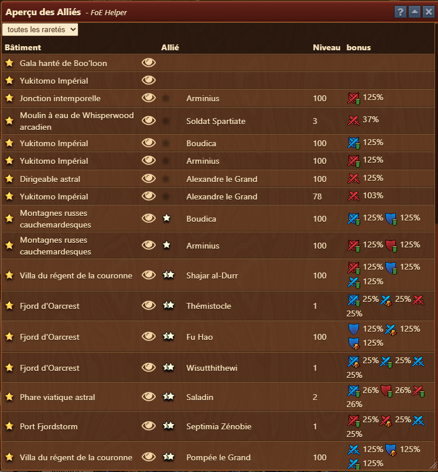

# Aperçu des Alliés

 


Ce module peut-être activé dans  [parametres](../parametres/README.md#pop-up)


Le module **Aperçu des alliés** fournit une vue centralisée de tous les alliés actuellement affectés à vos bâtiments, y compris leur niveau, leur rareté et les bonus qu'ils apportent à la force militaire de votre ville.

## Structure

L'interface comprend :

- **Filtre déroulant** (en haut à gauche) : permet de filtrer les bâtiments par rareté des pièces alliées (par exemple, commune, rare, épique).
- **Tableau de données** avec les colonnes suivantes :
  - **Bâtiment** : Nom du bâtiment abritant une salle Allié.
  - **Rareté** : La rareté d'un bâtiment allié peut tenir. (★ pour la rareté)
  - **Vue** : Ouvre [Aperçu de la ville](../ville/README.md#structure) en mettant en évidence le bâtiment sélectionné.
  - **Rareté** : Rareté d'un allié. (★ pour [rareté](#îcone-rareté))
  - **Allié** : Nom de l'allié (par exemple, Boudica, Alexandre le Grand).
  - **Niveau** : indique le niveau actuel de l'allié.
  - **Bonus** : affiche les types et les valeurs de bonus fournis.

### Îcone rareté

 - ☆ = Commun
 - ★ = Peu commun
 - ★★ = Rare
 - ★★★ = Épique
 - ⭐ = Légendaire
 
 
Depuis la mise à jour de décembre 2025, tous les bâtiments peuvent acceuillir toutes les raretés.


## Utilisation

Cette vue vous aide à :
- Suivez les alliés non assignés et les bâtiments inoccupés
- Suivez toutes les missions des alliés dans votre ville
- Comparez rapidement quels alliés offrent les bonus les plus importants
- Échangez ou réaffectez des alliés pour un bénéfice optimal

## FAQ

**Q : Comment puis-je faire progresser un allié ?** 
R : Collectez de l'XP grâce au jeu.

**Q : Puis-je modifier le bâtiment auquel un allié est affecté ?** 
R : Oui, utilisez l'interface du jeu pour déplacer ou réaffecter vos alliés à différents bâtiments.