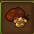
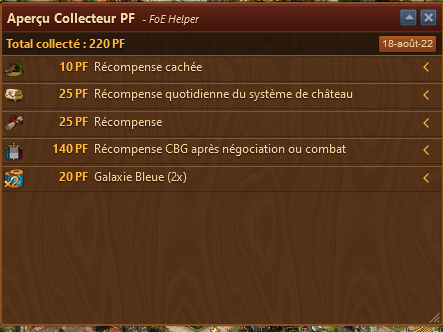
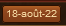
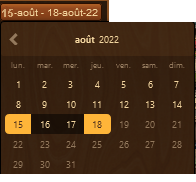
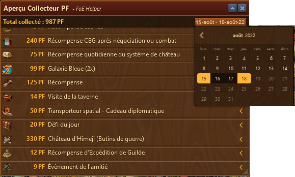
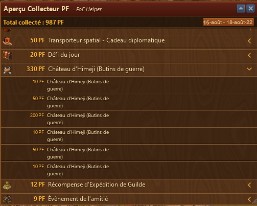

 # Aperçu Collecteur de PF

Affiche tous les détails des PF collectés triés par type, date, d'où et combien.

## Structure

* Le total des PF récoltés pour la période choisie
*  bouton affichant la période, mais ouvrant aussi un calendrier
* La zone d'affichage du détail de la récolte

## Le calendrier

Vous pouvez choisir une date seule ou un interval entre 2 dates. Les dates de départ et de fin seront en jaune clair.

Les montants seront affichés en total sur la période par genre de provenance.

## Vue détaillée

En cliquant sur le chevron à droite, vous pouvez voir le détail de chaque récolte pour un genre de provenance.
Ici sur l'image, on voit comment se répartissent les 330 PF de gains de l'Himeji entre le 15 et 18 août.