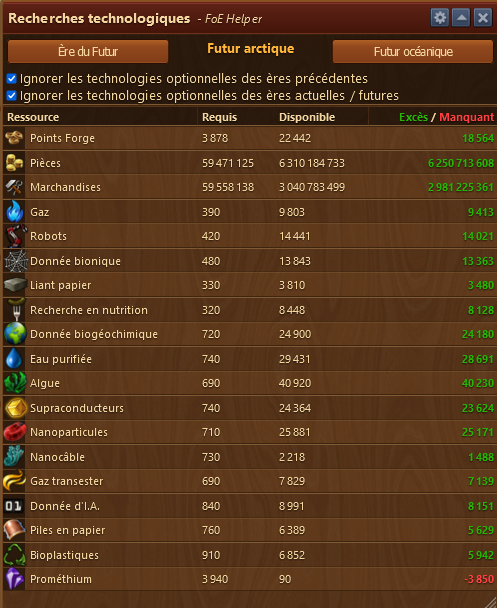

# Recherche Technologique

Ce module répertorie est affiche les besoins cumulés de ressources pour débloquer l'arbre technologique jusqu'à l'ère souhaitée. 



Vous devez ouvir l'arbre des technologies FoE avant d'ouvir ce module


## Structure

L'aperçu des besoins en ressource pour l'arbre technologique est structuré comme suit de haut en bas :

* Barre de titre avec le menu Configuration 
* Zone de paramètrage et choix des ères
* Zone d'affichage des ressources nécessaires

## Configuration

Le menu Configuration vous permet d'exporter les besoins de ressources en format CSV ou JSON

## Zone de paramètrage et choix des ères

le 1er bouton permet de revenir à l'ère précédente
le 2e bouton permet d'avancer d'une ère

au centre est affiché l'ère dont on veut savoir le besoin en ressource cumulé

les cases à cocher permettent d'ignorer les technologies optionnelles des ères précédentes et futur (par rapport à votre ère

## Zone d'affichage des ressources nécessaires

Les ressources manquantes sont affichées en rouge.

Affiche les ressources pour débloquer les technologies de votre ère. Si vous avancer dans les ères, c'est le total des ressources nécessaire qui est affiché et pas seulement le besoin en ressource de l'ère affichée.
c'est l'avantage de ce module sur l'affichage proposé par FoE.