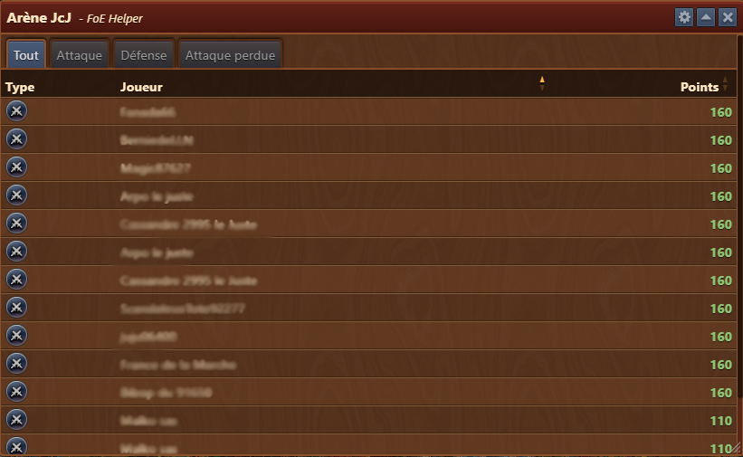
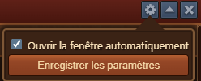

# Arène JcJ


Ce module peut-être activé dans [parametres](../parametres/README.md#pop-up)


Le module **Arène JcJ** vous permet de suivre vos performances dans l'arène Joueur contre Joueur. Il enregistre vos attaques, défenses, batailles perdues et changements de points dans une liste facile à lire.

## Structure

La fenêtre est structurée comme suit :

- **Barre de titre** avec menu [Configuration](#configuration)
- **Onglets de filtre** :
  - **Tout** : affiche toutes les rencontres enregistrées
  - **Attaque** : affiche uniquement vos batailles initiées
  - **Défense** : répertorie les attaques entrantes des autres joueurs
  - **Attaques perdues** : met en surbrillance uniquement les attaques que vous avez perdues
- **Tableau du journal de bataille** :
  - **Type** : Attaque ou Défense (affiché avec des icônes)
  - **Adversaire** : Nom du joueur adverse
  - **Points** : Points gagnés (vert) ou perdus (rouge)

##Configuration

L'interface de configuration est structurée comme suit :
- **Ouvrir la fenêtre automatiquement** : Si cette option est activée, ce module s'ouvrira automatiquement chaque fois que vous entrerez dans l'arène JcJ du jeu.

## Utilisation

- Entrez dans l'arène JcJ du jeu.
- Le module Arène JcJ s'ouvrira automatiquement s'il est activé dans [Paramètres](../parametres/README.md#pop-up)
- Utilisez les filtres des onglets pour affiner la liste à des types de batailles spécifiques.
- Analysez vos gains/pertes de points pour améliorer votre stratégie et identifier les tendances.
- Les changements de points vous aident à comprendre quelles batailles ont le plus impacté votre classement JcJ.

## Remarques

- Une valeur de point rouge (par exemple, « -628 ») indique une **perte de points**.
- Une valeur de point vert (par exemple, `+603`) indique un **gain de points**.
- La liste se met à jour automatiquement à chaque nouveau résultat de bataille.
- Le module prend en charge uniquement les données Arène JcJ, pas les attaques de voisins régulières.

##FAQ

**Q : Que représentent les icônes dans la colonne « Type » ?** 
R : Ils indiquent si l'entrée est une attaque, une défense ou une attaque perdue.

**Q : Puis-je voir qui m'a attaqué ?** 
R : Oui, les entrées défensives afficheront le nom de l’attaquant et le changement de point.

**Q : Pourquoi certaines entrées sont-elles en rouge ?** 
R : Les valeurs rouges indiquent les batailles où vous avez perdu des points, souvent à cause d'une défaite.

**Q : À quelle fréquence cette liste est-elle mise à jour ?** 
R : Il se met à jour automatiquement lorsque l'on entre dans l'arène JcJ du jeu.

**Q : Lorsque j'ouvre l'arène PvP, ce module n'est pas disponible ?** 
R : Vous pouvez l'activer dans [Paramètres](../parametres/README.md#pop-up).