# Aperçu des unités militaires

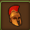

L'aperçu des armées affiche l'état actuel de vos armées.


Pour ouvrir ce module, vous devez auparavant ouvir la fenêtre de gestion des armées du jeu 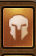


## Structure

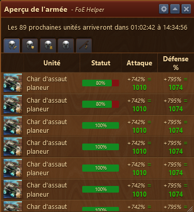

L'aperçu des Armées est structuré ainsi :

* Barre de titre avec le menu Configuration à droite 
* Zone d'affichage de la livraison des prochaines unités par Alcatraz
* Zone d'onglet avec l'état des différentes troupes

## Configuration

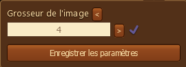

La configuration vous permet de changer la grandeur des images des troupes affichés dans ce module.

## Zone d'affichage de livraison d'unités

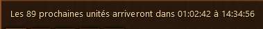

Est indiqué quand Alcatraz livrera ses prochaines unités. Durée d'attente, heure de livraison et nombre d'unité

## Zone d'onglet avec l'état des différentes troupes

* ### Armée d'attaque 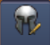

La santé des unités est affichée. La barre rouge indique de manière visuel la part blessée de l'unité. Et affiché églement le % d'attaque et de % défense en tenant compte des bonus actifs

* ### Armée de défense 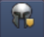

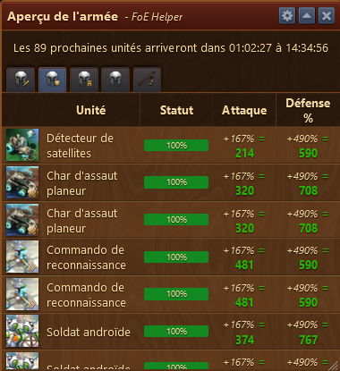

La santé des unités est affichée. La barre rouge indique de manière visuel la part blessée de l'unité. Et affiché églement le % d'attaque et de % défense en tenant compte des bonus actifs

* ### Armée de l'arène JcJ 

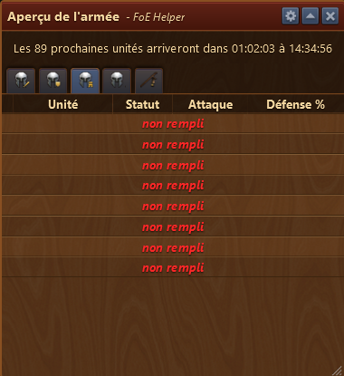

Si une ou des unités ne sont pas définie dans la gestion de l'armée, alors l'emplacement est marqué "non rempli" en rouge.

* ### Pool d'unités 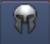

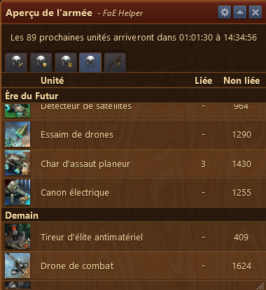

Ce masque montre, par ère, le nombre de chaque unité que vous avez en stock. Les unités **Liée** sont les unités qui sont dans vos casernes. Les unités **non liée** sont les unités gagnées en EG, quêtes, CbG ou fournies par Alcatraz.

* ### Dernière production d'Alcatraz 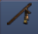

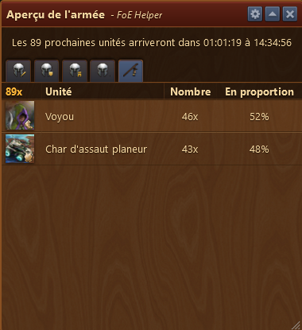

Affiche la dernière production d'Alcatraz. Avec le nombre d'unité fournie par vos casernes. et la proportion en % que chaque unité représente par rapport au total.


La dernière production d'Alcatraz n'affiche que la **dernière récolte effectuée sur le PC** où vous jouez.

 
Si vous récoltez sur un autre PC ou sur mobile, la récolte Alcatraz montrera la dernière récolte sur le PC et pas la dernière effective.
