# Assistant de jeu Aztèque

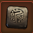 

L'assistant de jeu Aztèque affiche par dessus le mini-jeu aztèque les probabilités de trouver une récompense

## Structure

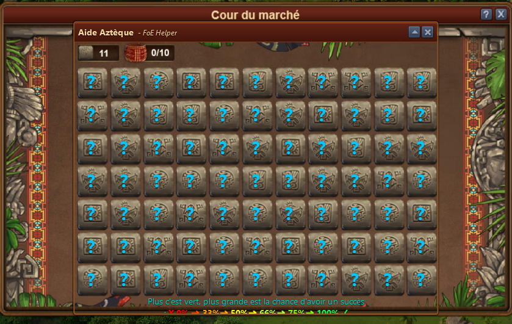

Au départ, l'affichage est constitué que de points d'interrogation bleu. Dès qu'on clique sur une case, les probalités changent pour les cases adjacentes.

## Probabilités

Les points d'interrogation de couleur affichent la probabilité d'avoir une récompense.

**Plus c'est vert, plus grande est la chance d'avoir un succès**

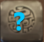 
Probabilité inconnue de trouver une récompense

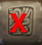
Probabilité Zéro de trouver une récompense

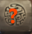
Probabilité jusqu'à 33% de trouver une récompense

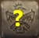
Probabilité jusqu'à 50% de trouver une récompense

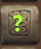
Probabilité jusqu'à 75% de trouver une récompense

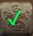
vous avez une récompense !

### exemples

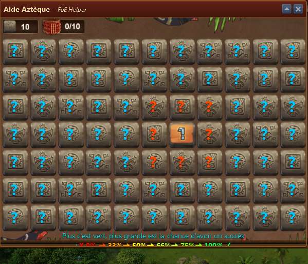
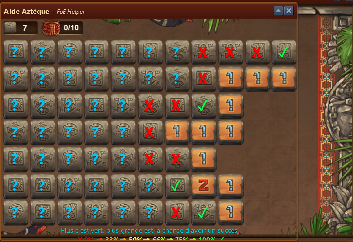
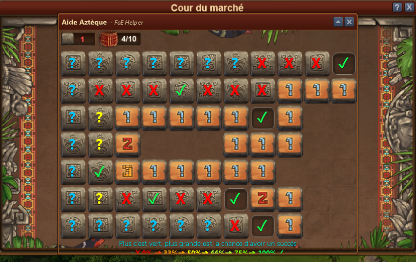
