# Champ de bataille de guilde
 

Le module Champ de bataille de guilde vous informe sur les secteurs à prendre, l'avancement des différentes guildes et les timers de libérations. Il permet de mettre aussi des [alarmes](#alarme_cbg)

## Structure

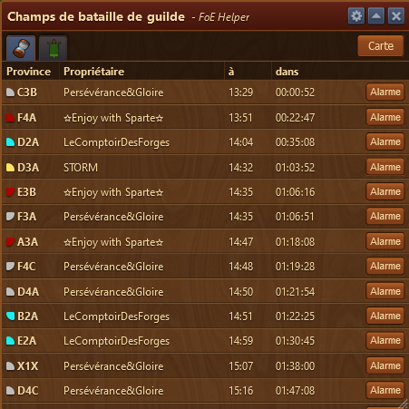

L'aide pour le champ de bataille est structuré ainsi :

* Barre de menu avec le menu Configuration 
* Onglet Timer 
* Onglet Progression 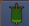
* Affichage de la carte 

## Configuration

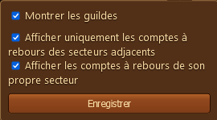

Permet d'afficher ou pas certains éléments dans les onglets

## Onglet Timer

Cet onglet affiche le nom des provinces, le propriétaire actuel l'heure de libération, la durée effective et surtout la possibilité de programmer une [alarme](#alarme_cbg) via le bouton  

Un message vient attester l'enregistrement. 
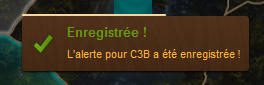

L'alarme peut être supprimée ensuite en cliquant sur le bouton "Effacer l'alarme" 
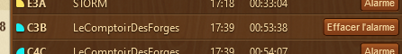

Un message confirme l'effacement. 
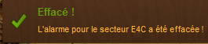

## Onglet Progression

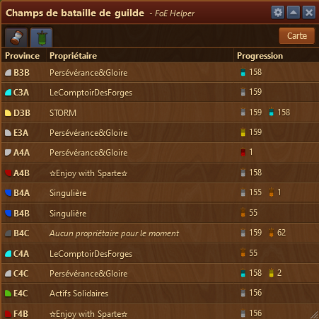

Cet onglet affiche le nom de la province avec la couleur du propriétaire, le nom de la guilde possédante, et la progression des autres guildes sur ce secteur.

## Carte

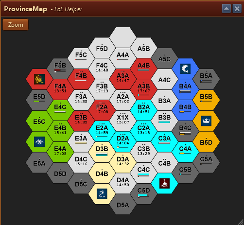

un bouton zoom  permet d'afficher la carte en grand afin d'y voir les détails.

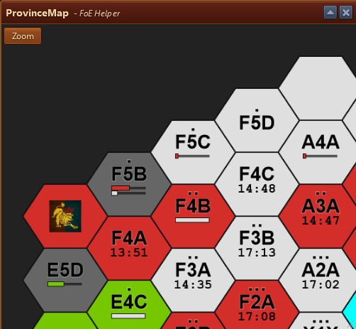

### Navigation sur la carte zoomée

en cliquant droite et en tenant le clic, vous pouvez faire bouger le zoom sur la carte.

### Nombre d'emplacement sur les secteurs

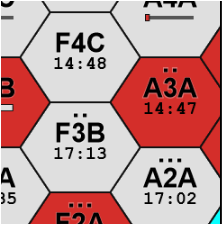

Le nombre d'emplacement sur les secteurs est indiqués par des points noirs en dessus du nom
L'heure de libération est affichée sous le nom

### Affichage de la progression

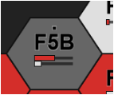

Avec le zoom, on voit mieux la progression de chaque guilde sur un secteur

On ressort du mode Zoom, en recliquant sur le bouton zoom 