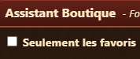
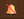
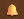
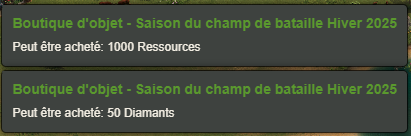
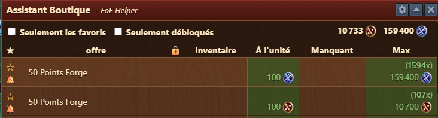
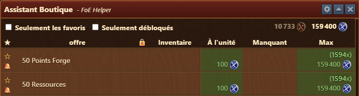
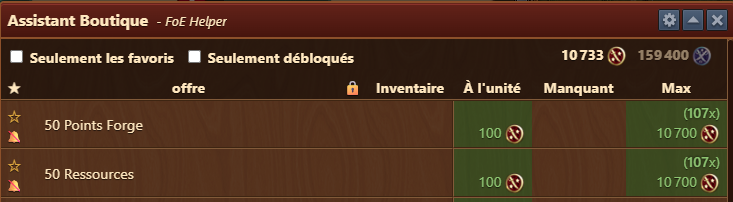
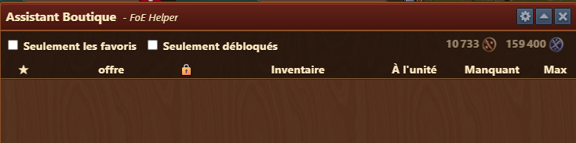
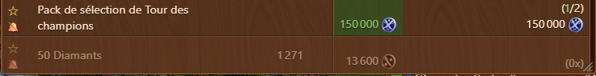

# Assistant Boutique


Ce module peut-être activé dans [parametres](../parametres/README.md#pop-up)


 

Le module **Assistant Boutique** vous permet de retrouver facilement dans les différentes boutiques les articles qui vous intérerssent. 

## Structure

La fenêtre est structurée comme suit :

- **Barre de titre** avec menu [Configuration](#configuration)
- **Zone de filtre** :
  - **Seulement les favoris** : affiche les articles [favoris](#favoris)
  - **Seulement débloqués** : affiche uniquement les articles débloqués (dans les évents)
  - **Monnaie** : Si plusieurs monnaies sont disponible dans une boutique, permet de [cacher](#Cacher-une-monnaie) les articles de la monnaie sélectionnée
- **Zone des articles** :
  - **Favoris** : Affiche si l'article est [favoris](#favoris)
  - **Alarme** : Affiche si une [alarme](#alarme) est active
  - **Offre** : Article de la boutique
  - **Cadenas** : Si l'article est bloqué car les conditions d'achat pas encore remplie
  - **Inventaire** : Le nombre d'objet dans votre propre Inventaire
  - **A l'unité** : Le prix à l'achat de l'article
  - **Manquant**  : Combien de fragments sont manquant pour compléter un objet et le coût total en monnaie
  - **Max** : Le nombre d'article maximum que vous pouvez acheter. Si des articles ont déjà été acheté, il sera noté 1/6 par exemple (pour 1 achat)

## Configuration

L'interface de configuration est structurée comme suit :
- **Ouvrir la fenêtre automatiquement** : Si cette option est activée, ce module s'ouvrira automatiquement chaque fois que vous entrerez dans les boutiques du jeu.

## Utilisation

Afin d'avoir un oeil sur vos articles favoris, il est conseillé de mettre en favoris les articles, voir d'activer une alarme.

### Favoris

 - L'article n'est pas marqué comme favori. Un clic de souris sur l'étoile active le favori 
 - L'article est marqué comme favori. Un clic de souris sur l'étoile va désactiver le favori 

Avec le filtre **Favori**, seul ces derniers seront affichés 

### Alarme

 - L'article n'a pas d'alarme. Un clic de souris sur la cloche va activer l'alarme 
 - L'alarme est active pour l'article. Un clic de souris la désactive 

Quand une alarme est active, ce type de message apparait dès que les conditions sont remplies pour acquérir l'article 

Le message disparait après 1 minute environ

### Cacher une monnaie

La boutique **Championnat du Champ de bataille** a par exemple 2 monnaies.  

Vous pouvez filtrer l'une des monnaies en cliquant dessus :  

Seul les articles de la monnaie Platine sont affichées. 

ou vice-versa  

Si vous cliquez sur les deux monnaies, alors la liste sera vide.  

Un clic sur l'une ou l'autre, voir les deux monnaies va réafficher les articles.

## FAQ

**Q: Je ne vois pas mes packs de 50 diamants pour le championnat CbG** 
R: Si vous avez déjà acheté tous les packs disponible, alors l'article se trouvera tout en bas de la liste en grisé 

