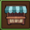
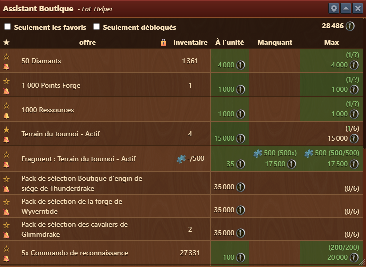
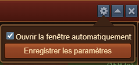
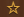
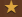

# Assistant Boutique


Ce module peut-être activé dans [parametres](../parametres/README.md#pop-up)


 

Le module **Assistant Boutique** vous permet de retrouver facilement dans les différentes boutiques les articles qui vous intérerssent. 

## Structure

La fenêtre est structurée comme suit :

- **Barre de titre** avec menu [Configuration](#configuration)
- **Zone de filtre** :
  - **Seulement les favoris** : affiche les articles [favoris](#favoris)
  - **Seulement débloqués** : affiche uniquement les articles débloqués (dans les évents)
  - **Monnaie** : Si plusieurs monnaies sont disponible dans une boutique, permet de [cacher](#Cacher-une-monnaie) les articles de la monnaie sélectionnée
- **Zone des articles** :
  - **Favoris** : Affiche si l'article est [favoris](#favoris)
  - **Alarme** : Affiche si une [alarme](#alarme) est active
  - **Offre** : Article de la boutique
  - **Cadenas** : Si l'article est bloqué car les conditions d'achat pas encore remplie
  - **Inventaire** : Le nombre d'objet dans votre propre Inventaire
  - **A l'unité** : Le prix à l'achat de l'article
  - **Manquant**  : Combien de fragments sont manquant pour compléter un objet et le coût total en monnaie
  - **Max** : Le nombre d'article maximum que vous pouvez acheter. Si des articles ont déjà été acheté, il sera noté 1/6 par exemple (pour 1 achat)

## Configuration

L'interface de configuration est structurée comme suit :
- **Ouvrir la fenêtre automatiquement** : Si cette option est activée, ce module s'ouvrira automatiquement chaque fois que vous entrerez dans les boutiques du jeu.

## Utilisation

Afin d'avoir un oeil sur vos articles favoris, il est conseillé de mettre en favoris les articles, voir d'activer une alarme.

### Favoris

 

## FAQ

**Q: Je ne vois pas mes packs de 50 diamants pour le championnat CbG** 
R: Si vous avez déjà acheté tous les packs disponible, alors l'article se trouvera tout en bas de la liste en grisé

**Q: Fias da Kini gwihss mehra des is schee Biazelt Edlweiss glei.?** 
R: Jedza nimma Woibbadinga vui a Maß und no a Maß lem und lem lossn, a Maß und no a Maß aba Biakriagal nomoi.
