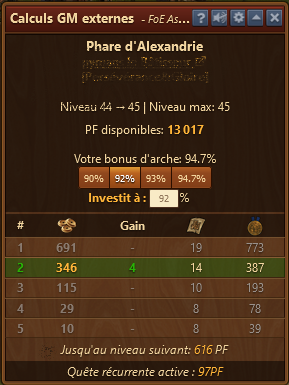
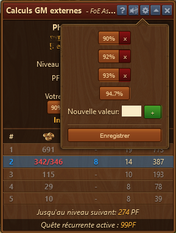
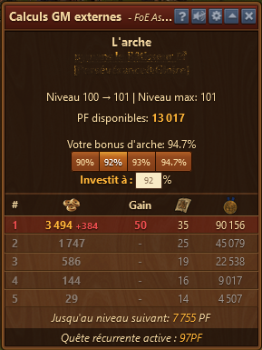
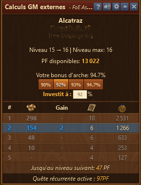
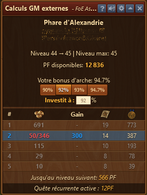
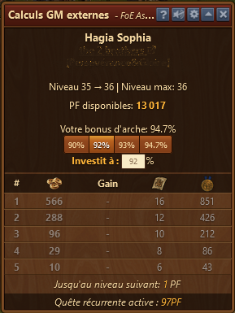
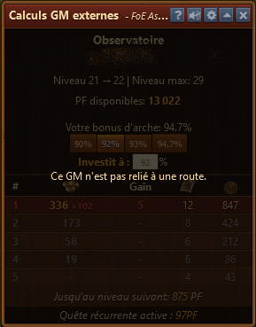

# Calculatrice GM externe

Si vous souhaitez aider les joueurs à se mettre à niveau ou même les aider contre leur gré, cet outil est indispensable. Il calcule toutes les valeurs pertinentes pour vous, et vous pouvez le définir comme vous le souhaitez. 

## Structure

La calculatrice GM externe est structurée comme suit de haut en bas :

* Nom du Grand Monument
* Propriétaire inclus un lien vers [https://foe.scoredb.io/page du joueur](https://foe.scoredb.io/Worlds)
* Guilde du propriétaire
* Niveau du Grand Monumenent et jusqu'à quel niveau il peut être monté
* **Points de Forge disponible :** Affichage du nombre de points de forge disponible dans ton inventaire
* **Bonus d'arche :** Le vrai bonus de votre arche (ici 94.7%)
* Bouton pour changer le pourcentage de pose
* **Investit à :** ici vous pouvez vous-même définir n'importe quel pourcentage
* Tableau :
  * Place de mécénat
  * Le nombre de PF qui doivent être payé par place. Les nombres sont calculés sur la base du pourcentage ci-dessus
  * La différence entre les PF à déposer et le bonus d'arche
  * Le nombre de plans obtenus grâce au bonus d'arche
  * Le nombre de médailles obtenues grâce au bonus d'arche
  * **Jusqu'au niveau suivant :** Le nombre de PF nécessaire pour finir le Grand Monument
  * **Quête récurrente active :** Indique si une quête récurrente a été terminée

## Configuration

Vous pouvez au moyen de la roue dentée dans la barre de titre définir quels boutons de pourcentage doivent être affichés.

## Utilisation

Les nombres dans le tableau des places de mécénat peuvent avoir des couleurs différentes, ce qui indique si c'est sécurisé de poser ou pas.

### Vert = Place de mécénat sécurisée

Si une place est sécurisée, elle ne peut pas faire l'objet d'une surechère après ton investissement. La ligne est surlignée en vert.

### Rouge = Place de mécénat pas sécurisée

Si une place n'est pas encore sécurisée et peut faire l'objet d'une surenchère, la ligne apparait en rouge et indique (chiffre rouge derrière) combien de PF manque pour la sécurisation.

### Bleu = déjà posé

Vous avez déjà posé le montant sur le Grand Monument et la ligne est affichée en bleu.  Elle reste en bleu quand vous ouvrez le Grand Monument plus tard et que votre dépôt est reconnu.

Vous n'avez pas encore posé le montant demandé, alors le chiffre est affiché en rouge (posé / à poser).

### Place de mécénat non disponible

Les places de mécénat affichée en gris ne peuvent pas être prises.

Si le niveau suivant du Grand Monument n'est pas ouvert, les places de mécénat ne peuvent pas être prises.

Les places de mécénat ne peuvent pas être prise quand le Grand Monuement n'est pas relié à une route.
