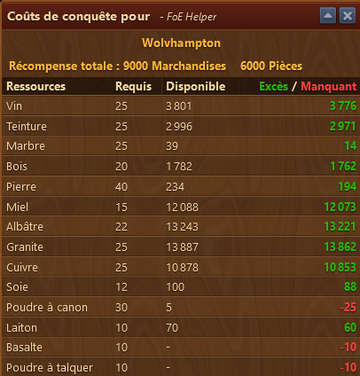

# Carte de campagne

Ce module vous affiche les gains et les coûts en ressources pour acquérir une province de la carte de campagne.


Pour ouvrir ce module, vous devez auparavant ouvir la fenêtre de la carte de campagne du jeu 


## Structure

L'aperçu de la carte de campagne est structuré ainsi :

* Le nom de la province
* Les récompenses en pièces et marchandises
* Zone d'affichage des ressources nécessaire en négociation pour acquérire la province

Les ressources manquantes sont affichées en rouge. En vert, sont affichées les ressources excédentaires.