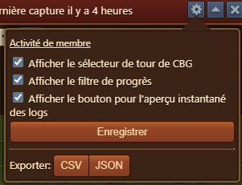
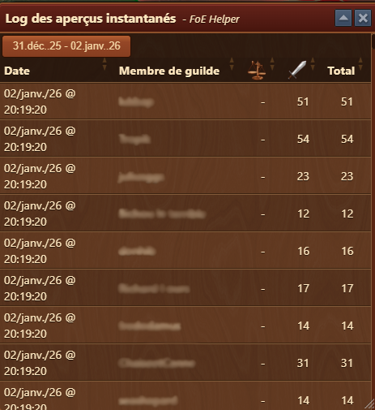

# Aperçu Joueur CbG


Ce module peut-être activé dans [parametres](../parametres/README.md#pop-up)


## Structure

L'interface du module contient :

- **Barre de titre** avec menu [Configuration](#configuration)
- **Sélecteur de plage de dates** : permet de filtrer par cycle GbG (par exemple, du 01 janv. 26 au 12 janv. 26).
- **⬆** : le bouton de filtre de progression filtre la liste pour afficher uniquement les joueurs qui ont eu une activité depuis le dernier instantané.
- [**Instantanés**](#Instantané) : ouvre le journal historique des instantanés GbG à des fins de comparaison.
- **Colonnes du tableau** :
  - **Membre de guilde** : affiche la liste classée avec les avatars et les noms des joueurs.
  - **Négociations** : nombre de négociations effectuées pendant la période sélectionnée.
  - **Combats** : nombre de batailles livrées.
  - **Total** : Somme des négociations et des combats.
  - **Attrition** : affiche le niveau d'attrition actuel du joueur.
  - **Bouton Chevron (›)** : développe la vue détaillée du joueur pour des informations plus approfondies.


Les lignes en surbrillance verte indiquent les augmentations d'activité depuis le dernier instantané


## Configuration

L'interface de configuration est structurée de haut en bas comme suit :
- **Afficher le sélecteur de Tour GBG** : affiche le sélecteur de ronde GBG dans [Structure](#structure)
- **Afficher le filtre de progression** : affiche le bouton **⬆** dans [Structure](#structure)
- **Afficher le journal des instantanés** : affiche le bouton du journal des instantanés dans [Structure](#structure)
- **Enregistrer** : bouton pour enregistrer les configurations des cases à cocher
- **Export** : vous permettant d'exporter des données vers `CSV` ou `JSON` pour les archiver

## Instantanés

Le **Le journal des instantanés** fournit un enregistrement historique de l'activité GBG à des horodatages spécifiques.

L'interface du module contient :

- **Date et heure** : affiche le moment exact de la capture des données.
- **Membre de la guilde** : nom du joueur.
- **Négociations**, **Combats** et **Total** : actions effectuées par le joueur à cet horodatage.
- **Tri** : les colonnes peuvent être triées pour analyser qui a le plus contribué à chaque instantané.

Des instantanés sont pris automatiquement à chaque fois que le classement GBG dans le jeu est ouvert et représentent le nombre d'actions GBG enregistrées jusqu'à ce moment. Cela permet de suivre les changements au fil du temps, comme les progrès réalisés entre deux points.

## Utilisation

1. Ouvrez l'aperçu GBG pendant un cycle GBG actif ou passé.
2. Utilisez le menu déroulant **Tour GBG** pour sélectionner la plage de dates souhaitée.
3. Consultez les contributions des membres en temps réel ou via le **Journal des instantanés**.
4. Cliquez sur le **chevron (›)** à côté d'un joueur pour développer les détails de sa contribution.
5. Les données sont automatiquement mises à jour à chaque instantané.

## Cas d'utilisation

- Comparez les niveaux d'activité à travers la guilde
- Identifier les meilleurs contributeurs
- Encourager les membres les moins actifs
- Planifiez des récompenses ou des classements de guilde en fonction de la participation

##FAQ

- **À quoi sert le journal des instantanés ?** 
  Il vous permet de suivre les changements au fil du temps en comparant les contributions passées avec les données actuelles.

- **Est-ce que cela inclut les non-membres de la guilde ?** 
  Non, l'aperçu inclut uniquement les membres actuels de votre guilde.

- **Qu'indique l'attrition ?** 
  Il montre combien d'attrition le joueur a accumulé en GBG au cours de la période sélectionnée.

- **Puis-je trier les colonnes ?** 
  Oui, cliquez simplement sur les en-têtes de colonnes pour trier par combats, négociations ou total.

- **À quoi sert la flèche à côté d'un joueur ?** 
  Il ouvre le journal d'instantanés filtré pour afficher une répartition plus détaillée de l'activité GBG de ce joueur.