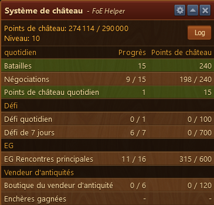
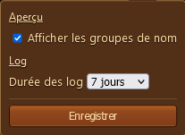
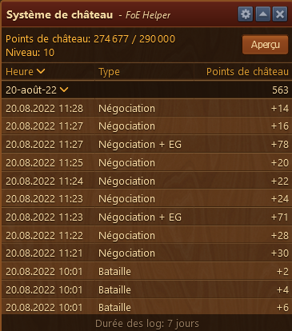

# Système de chateau

 

Le module Système de chateau vous indique votre progression dans l'acquisition des points de chateau.

## Structure

* Menu Configuration  
* Affichage des points de chateau actuel / seuil a atteindre pour le prochain niveau et le niveau actuel.
* Bouton pour afficher les log 
* Zone d'affichage des points

## Configuration

Le menu Configuration vous permet de spécifier la durée de conservation des log du système de chateau et d'afficher les noms de groupe dans la fenêtre principale.

## Utilisation

Affiche les 4 groupes qui rapportent des points de chateau ainsi que le nombre de progrès pour avoir le gain maximal.

Le bouton  vous permet d'afficher le détail des gains

Le bouton  vous permet de revenir à la fenêtre précédente.