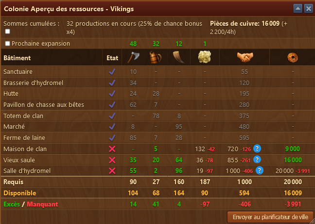
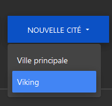

# Aperçu des ressources de la colonie

Affiche les ressources nécessaires pour terminer la colonie

## Structure

Affiche les ressources nécessaires pour débloquer les batiments de la colonie.
Affiche le manque de diplomatie pour débloquer les batiments de la colonie et et au moyen du ? bleu, vous permet de connaitre commment combler le manque de diplomatie.
Afiche le prix de la prochaine extention
Permet d'envoyer le plan de la colonie au [planificateur de ville](../.././site_web/planificateur_cite/README.md)

 
Le message qui confirme que votre colonie a été envoyée au site web.

vous la trouverez dans le menu >Nouvelle cité

