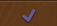
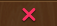
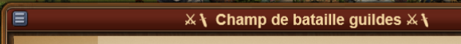
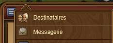

# Comparer les amis

 

Ce module permet de voir avec quels amis vous avez des fils de conversation sociaux en commun.

## Structure

La fenêtre affiche sur la gauche le nom de vos amis et sur la droite, vis à vis de chaque conversation que vous ouvrez, s'ils participent également à ce fil.

## Configuration

## Utilisation

Un  signale que vous êtes actif dans le même fil de conversation. Un  indique le contraire.

Pour comparer une nouvelle conversation, vous devez ouvir dans le menu de la conversation, la liste des destinataires.
 
Cliquer sur les 3 tirets et choississez le menu "Destinataires" 

Dans la fenêtre principale, une nouvelle conversation s'affiche avec la participation ou non de vos amis.

