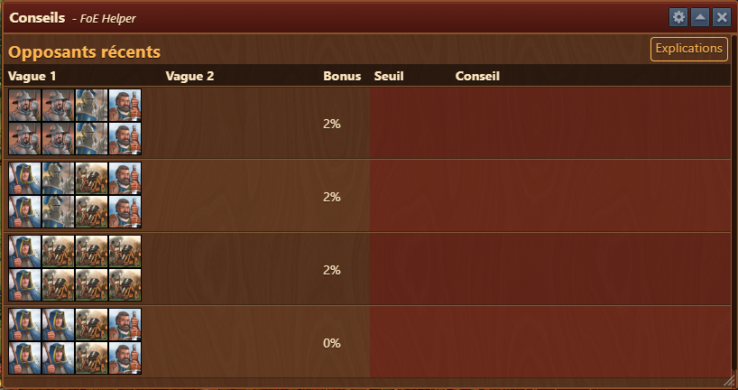
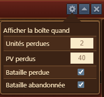
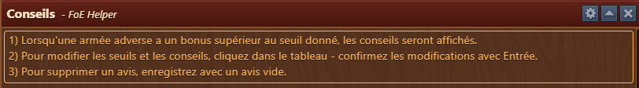
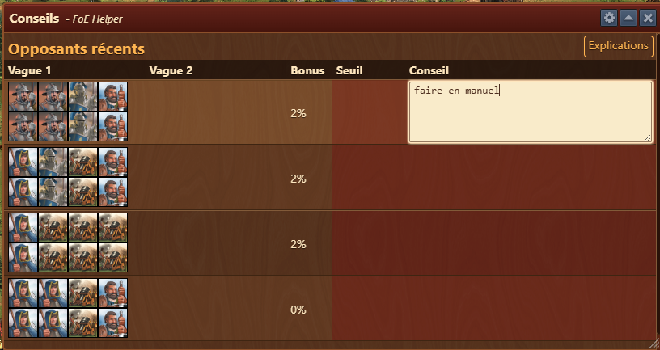
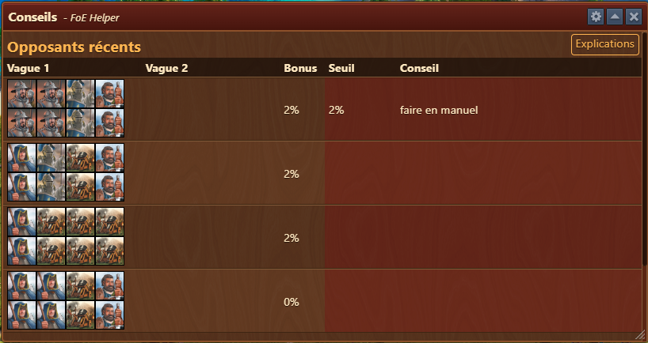
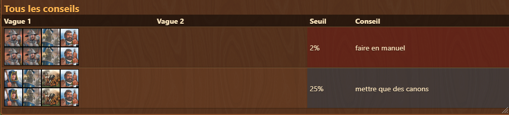
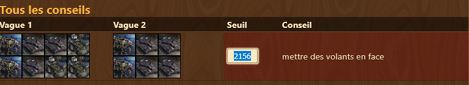

# Conseil de l'armée


Ce module peut-être activé dans [parametres](../parametres/README.md#pop-up)


Le module **Conseil de l'armée** vous permet de noter des astuces pour passer des compositions difficles en combats. Il s'affiche en foncton de critère que vous déterminer.

 ## Structrure
 
 
 
 La fenêtre est structurée comme suit :

- **Barre de titre** avec menu [Configuration](#configuration)
- **Bouton Explication** pour afficher le fonctionnement de la [fenêtre](#utilisation)
- **Zone de donnée** avec les compositions rencontrées et les conseils pour les passer

## Configuration

L'interface de configuration est structurée comme suit :
- **Unités perdues** : seuil d'unité pour afficher la fenêtre automatiquement à la fin d'un combats
- **PV perdus** : seuil de PV (point de victoire) perdu pour afficher la fenêtre automatiquement à la fin d'un combats
- **Bataille perdue** : case à cocher pour ouvrir à chaque bataille perdue
- **Bataille abandonnée** : case à cocher pour ouvrir à chaque bataille abandonnée

## Utilisation

 
 
 ### Exemple
 
  
 pour enregistrer le conseil, vous devez faire appuyer sur la touche "enter"  
 
 
 les conseils s'affichent en bas de la fenêtre. 
 
 
 
 ## FAQ

**Q: Puis-je modifier une entrée ?** 
R: Oui, vous pouvez modifier une entrée après coup, en cliquant sur la zone de texte (conseil ou seuil) 

 
 **Q: Puis-je supprimer une entrée ?** 
R: Oui, il suffit d'enregistrer un conseil vide.
 