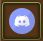
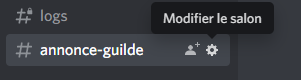
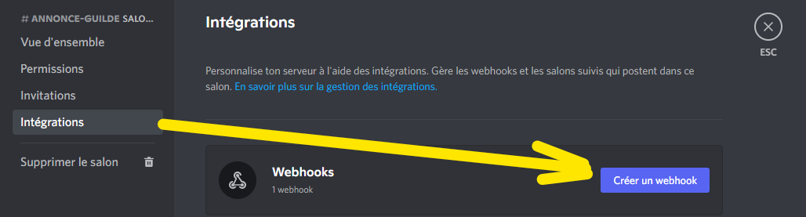
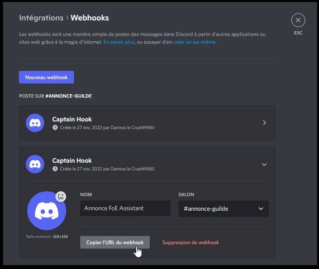
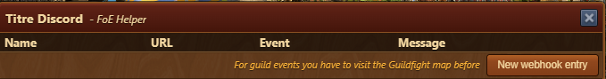

# Discord Webhooks

 

Ce module permet d'envoyer des messages dans un salon Discord en fonction d'évènement survenant dans le jeu.

## Installer un webhook dans Discord


Pour installer un webhook dans Discord, tu dois avoir les permissions nécessaires.


Un Webhook peut être établi pour chaque salon d'un Discord. Vous procédez comme suit.

Cliquez sur la roue dentée à côté du salon dans laquel vous souhaitez que les annonces apparaissent :

Là, cliquez sur "Intégration" > "Créer un webhook" :

Changez le nom en quelque chose de significatif afin que vous puissiez vous rappeler plus tard de quel type de webhook il s'agit. Le nom du bot qui publie le message n'a rien à voir avec cela.

Cliquez ensuite sur le bouton "Copier l'URL du WebHook" et fermez toutes les fenêtres. Dans Discord, vous avez terminé.

## Inclure WebHook dans l'assistant


Si vous souhaitez travailler avec des événements des batailles de guilde, vous devez visiter le champ de bataille avant de créer un nouveau Webhook.


Remplir les champs comme demandé.


**Icônes** Vous pouvez utiliser n'importe quelle icône de votre chaîne Discord. Survolez une icône dans le salon et saisissez-la avec _:name:_ dans le texte.


Une nouvelle ligne est simplement insérée avec la touche Entrée (saut de ligne).

Actuellement, il n'y a que l'événement "Guildfights" (première attaque) en combinaison avec un secteur. C'est une sorte de test BETA.

Pour obtenir du texte avec le nom de la province, vous pouvez utiliser <mark style="color: #e83e8c;">#gg_province_name#</mark>. Il sera remplacé lors de l'envoi du message.

## Utilisation d'un événement

Étant donné que l'assistant FoE est connu pour ne pas interroger les données de manière indépendante, l'événement doit être déclenché dans le jeu lorsque vous êtes connecté.

Précision : **Un** joueur unique par guilde met le webhook et doit ensuite garder la carte de guilde ouverte. Il n'en faut pas plus. Ces webhooks envoient des événements globaux dans un salon, ce qui signifie que cela n'aurait pas beaucoup de sens si le salon est privée.

Dès que l'information sur une attaque arrive en arrière-plan du jeu, le déclencheur est activé et le message est alors automatiquement envoyé une fois à Discord. Tous les abonnés de cette chaîne peuvent alors le lire.

## Autres événements

Un événement manque ou vous avez une autre bonne idée ?

Alors s'il vous plaît remplissez simplement ce ticket : [https://github.com/mainIine/foe-helfer-extension/issues/2543](https://github.com/mainIine/foe-helfer-extension/issues/2543)

