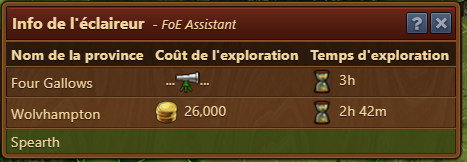

# Statut de l'éclaireur

Ce module vous montre l'état actuel de votre éclaireur lorsque vous entrez sur la carte - quelle que soit la carte sur laquelle vous ou l'éclaireur vous vous trouvez. La gestion de vos sites d'exploration (depuis l'ère Mars) ne vous distraira plus de l'exploration. 

## Structure

Le statut de l'éclaireur affiche les informations suivantes :

 * Combien coûte l'exploration d'une province spécifique et combien de temps cela prendra (2e ligne du tableau ci-dessus)
 * Vers quelle province l'éclaireur se dirige-t-il actuellement et combien de temps cela prendra (1ère ligne dans le tableau ci-dessus - mises à jour uniquement lors de l'ouverture de la carte)
 * Quelles provinces peuvent actuellement être conquises (fond vert - par exemple 3e ligne dans le tableau ci-dessus) 
 
 ## Configuration
 
 Dans les paramètres de l'extension, ce module peut être (dés)activé.