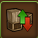
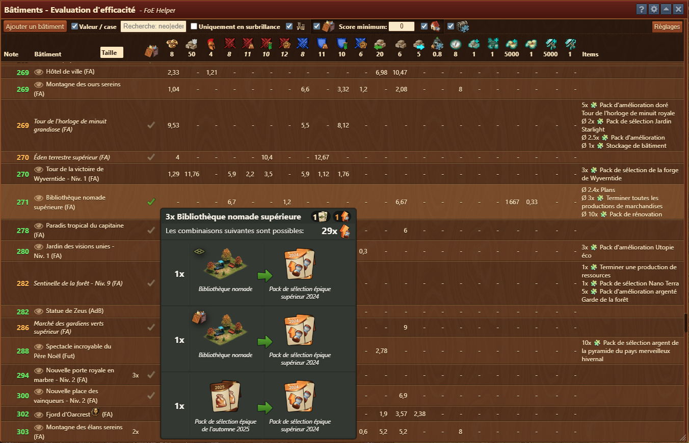
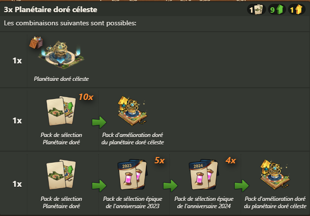
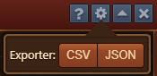
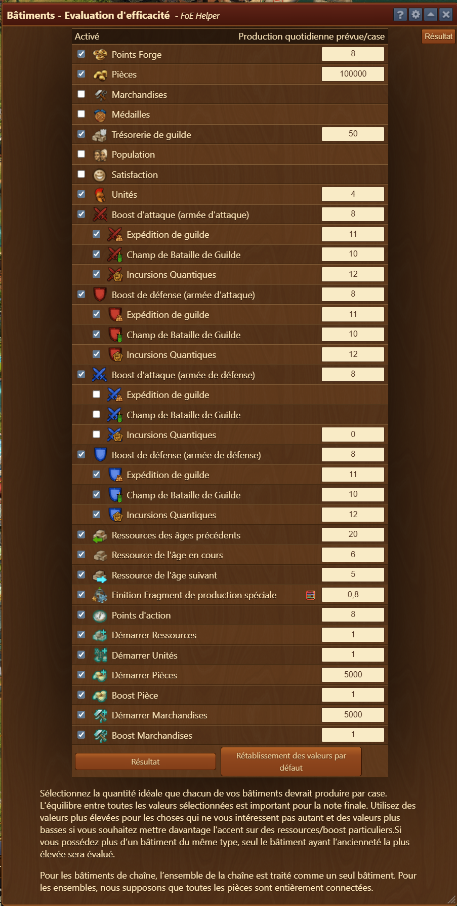
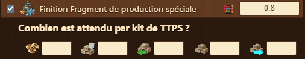
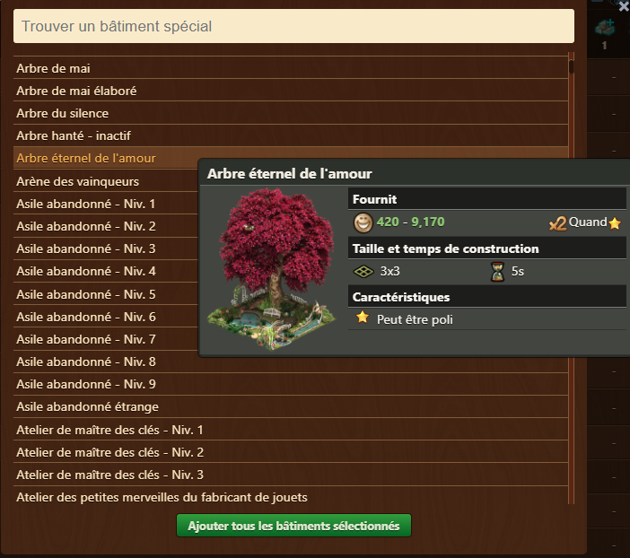

# Efficience des bâtiments

Comparez les bâtiments spéciaux en fonction de la production quotidienne par tuile, en utilisant vos propres priorités et attentes. Cet outil vous aide à déterminer quels bâtiments sont les plus efficaces pour l'aménagement de votre ville et vos objectifs stratégiques.


L’outil d’évaluation de l’efficacité des bâtiments est conçu comme une aide à l’orientation. Certains types de ressources peuvent ne pas encore être entièrement pris en charge, ce qui peut entraîner des évaluations de bâtiments incomplètes ou inexactes. 


## Structure

La fenêtre principale est composé des éléments suivants :

- **Barre de titre** avec un menu [Configuration](#configuration)
- **Barre d'outils** :
    - **Ajouter un bâtiment** : ouvre le [menu de sélection de bâtiment] (#ajouter_un_bâtiment).
    - **Valeur/tuile** : basculer entre les vues **Valeur/tuile** et **Productions résumées**.
    - **Champ de recherche** : mettez en surbrillance les bâtiments recherchés par leur nom.
    - ** Uniquement en surbrillance ** : activez cette option pour filtrer uniquement les bâtiments mis en surbrillance. (expliqué sous [Mise en évidence et sélection](#Mise_en_évidence_et_sélection)).
    - **Grands Monuments** : activez cette option pour inclure les Grands Monuments dans la **Vue Tableau**.
    - **Score minimum** : inclut uniquement les bâtiments d'inventaire dont le score est supérieur à un seuil défini dans la liste.
	- **Afficher les bâtiments augmentés** : basculer pour affiche/ masquer les **bätiments augmentés** dans la **Vue Tableau**
	- **Masquer les objets** : basculez pour afficher/masquer la colonne **Objets** de récompense de construction dans la **Vue Tableau**.
    - **Paramètres** : Ouvre le panneau de configuration (expliqué sous [Paramètres](#Paramètres))

- **Vue Tableau** : affiche tous les bâtiments évalués en lignes, avec des colonnes triables :
    - **Score** : score d'efficacité basé sur les attentes des utilisateurs.
      - Vert : Score pour les bâtiments disponibles dans la ville.
      - Orange : Score des bâtiments disponibles en inventaire.
      - Bleu : score pour les bâtiments ajoutés à partir du menu [menu de sélection de bâtiment] (#jouter_un_bâtiment).
    - **Nom du bâtiment, niveau et époque** du bâtiment. Pour plusieurs bâtiments, une seule époque est affichée. Consultez [Carte de la ville](../ville/README.md#Menu_latéral) pour plus de détails.
    - **Taille** : filtre les bâtiments selon les tailles sélectionnées.
    - **Montant** : Nombre de bâtiments placés dans votre ville.
    - **Inventaire** : affiche ✔ si le bâtiment est disponible dans l'inventaire. (expliqué sous [Tooltip_bätiment en inventaire](#Tooltip_bätiment_en_inventaire)).
    - **Colonnes de production** : les colonnes représentent chaque type de ressource activé avec leurs valeurs de pondération :
        - FP, pièces de monnaie, marchandises, boosts, fragments, unités et plus encore.
        - Les valeurs de production sont calculées par carreau et adaptées à vos attentes. (expliqué sous [Méthode d'évaluation](#méthode_d'évaluation)).
    - **Objets** : affiche les objets produits par le bâtiment.
	
## 	Mise en évidence et sélection
	
	Les bâtiments sont mis en évidence/sélectionnés dans l'aperçu du tableau par :
  - Cliquer sur une ligne met en évidence ce bâtiment.
  - Les bâtiments recherchés dans la **Barre de recherche** sont automatiquement mis en évidence avec 🔎.
  - Plusieurs bâtiments peuvent être mis en évidence simultanément pour une comparaison plus facile
  
  
Activez Uniquement les surbrillances pour restreindre la liste aux seuls bâtiments correspondants.


## Tooltip_bätiment en inventaire

L'info-bulle est visible en survolant « ✔ » dans la colonne d'inventaire, affichant les combinaisons disponibles pour construire le bâtiment sélectionné.

L'info-bulle comprend :
  - **Barre d'en-tête** :
    - Affichage du nombre total de bâtiments sélectionnés pouvant être assemblés (par exemple, 3x Planétaired doré céleste)
    - Objets nécessaires pour assembler un bâtiment (par exemple, 1 kit + 1 amélioration + 1 amélioration argentée)
  - **Tableau de combinaison** affichant toutes les combinaisons et le nombre de bâtiments pouvant être assemblés avec cette combinaison. par exemple. 3x Planétaires doré de l'exemple ci-dessus peuvent être assemblées de la manière suivante :
    - 1x provenant de : **Planétaire doré céleste** déjà construit
    - 1x provenant de : **Pack sélection Planétaire doré** `x10` + **Pack d'amélioration doré du planétaire doré céleste**
    - 1x provenant de : **Pack sélection Planétaire doré** + **Pack de sélection épique de l'anniversaire 2023** `x5` + **Pack de sélection épique de l'anniversaire 2024** `x4` + **Pack d'amélioration doré du planétaire doré céleste**


Les bâtiments présent en inventaire auront une icône d'inventaire, tandis que ceux présents dans la ville n'ont pas de marque.


- **Barre de pied de page** :
    - Affichage du niveau le plus élevé pour le bâtiment sélectionné (par exemple, Dirigeable astral)
    - Objets manquants pour assembler le plus haut niveau (par exemple, 1 mise à niveau en or)
	
	
## Configuration

L'interface de configuration vous permet d'exporter des données vers `CSV` ou `JSON` pour l'archivage

## Usage

- Définissez vos valeurs attendues pour chaque ressource ou boost dans les [Paramètres](#paramètres).
- Utilisez [Ajouter un bâtiment](#jouter_un_bâtiment) pour sélectionner les bâtiments que vous souhaitez comparer.
- Consultez le score et la répartition des ressources pour chaque bâtiment.
- Utiliser le tri pour identifier facilement les bâtiments les moins efficaces.
- Utilisez des filtres pour affiner le nom du bâtiment.
- Passez la souris sur n'importe quelle ligne pour inspecter les détails du bâtiment et les éléments associés.

## Méthode d'évaluation

Le score d'efficacité est calculé en comparant la production réelle de chaque bâtiment à votre valeur quotidienne attendue par tuile.

**Score = (Production ÷ Valeur attendue) ÷ (Tuiles + 1 là où la route est requise) × 100** 
(par exemple, 20 FP ÷ 10 FP attendus ÷ 2 tuiles = 1 × 100 = Score : 100)


Les bâtiments de la chaîne sont traités comme une seule entité en supposant une connexion complète. Les ensembles sont considérés comme si toutes les pièces étaient entièrement connectées.


## Paramètres

Le panneau **Paramètres** vous permet de définir ce que vous attendez de vos bâtiments. Ces valeurs sont essentielles au calcul du score d’efficacité de chaque bâtiment.

Le menu des paramètres est structuré comme suit : 
- **Barre de titre** avec un menu [Configuration](#configuration)
- [**Tableau des paramètres**](#tableau_des_paramètres) avec deux colonnes :
  * **Activé** : case à cocher qui inclut ou exclut la ressource du calcul et de la vue d'ensemble de l'efficacité.
  * **Production quotidienne/carreau attendue** : Un champ numérique qui définit votre taux de production souhaité par carreau et par jour.
- **Boutons** : en bas du panneau
  * **Résultat** : appliquez les attentes configurées et revenez à la vue de comparaison.
  * **Réinitialiser par défaut** : efface vos valeurs personnalisées et revient aux paramètres par défaut.
  
  
  
  ### Tableau des paramètres

Chaque ressource ou bonus est regroupée et répertoriée individuellement :

* **Ressources standards** :

  * Points Forges
  * Pièces de monnaie
  * Fournitures
  * Médailles
  * Pouvoir de guilde
  * Biens du Trésor
  * Population
  * Bonheur
  * Unités

* **Augmentations d'attaque et de défense** :

  * Divisé par type d'armée (attaque/défense) et contexte :

    * Expédition de guilde
    * Champs de bataille de guilde
    * Incursions quantiques

* **Marchandises**:

  * Ère précédente
  * Ère actuelle
  * Prochaine ère

* **Fragments** :

  * Terminer les fragments de production spéciaux (y compris le [calculateur TTPS](#Calculatrice_de_kit_TPS))

* **Incursions quantiques** :

  * Actions
  
  
### Calculateur de kit TPS

En cliquant sur l'icône à côté du champ de saisie, la calculatrice TTPS qui est utilisée pour déterminer la valeur de production/tuile pour les fragments « **T**erminer la **P**roduction **S**péciale » s'ouvrira.
Pour calculer la valeur des fragments TPS, saisissez la quantité de chaque ressource attendue par kit TPS, et la valeur sera calculée en fonction de vos entrées pour ces ressources dans [**Tableau des paramètres**](#tableau_des_paramètres).

### Info-bulle : Plage de comparaison

En survolant le champ de saisie, une info-bulle apparaîtra désormais avec les valeurs de comparaison de votre ville :

* **Meilleur** : Production la plus élevée par tuile de votre ville.
* **5ème meilleur** : Production par tuile du 5ème bâtiment le plus producteur.
* **Top 10 %** : Production par tuile la plus faible parmi les 10 % des bâtiments les plus riches.

### Utilisation des paramètres

1. **Activer** Cochez uniquement les ressources que vous souhaitez inclure dans [tableau de classement](#structure).
2. **Saisissez** la quantité que vous attendez des bâtiments à générer quotidiennement par tuile.
3. Cliquez sur **Résultat** pour appliquer vos paramètres et revenir au [tableau de classement](#structure).


Utilisez des valeurs attendues plus faibles pour les ressources que vous considérez comme plus précieuses, cela donne des scores plus élevés aux bâtiments qui les produisent.


## Ajouter un bâtiment

Ce menu vous permet de **rechercher, prévisualiser et sélectionner des bâtiments spéciaux**, que vous n'avez pas, à inclure dans la comparaison de l'évaluation de l'efficacité des bâtiments.

### Aperçu du menu Ajouter un bâtiment

Le menu Ajouter un bâtiment est structuré comme suit : 

* **Barre de recherche** : située en haut de la fenêtre, elle filtre la liste des bâtiments en fonction de leur nom. (par exemple, taper "Neo" affichera tous les bâtiments avec "Neo" dans le nom)

* **Liste des bâtiments** : Une liste déroulante affichant tous les bâtiments spéciaux disponibles. Chaque entrée comprend :

  * Nom du bâtiment
  * Niveau (le cas échéant)
  
 * **Info-bulle sur le bâtiment** : le survol d'un bâtiment ouvre une **popup d'aperçu** qui comprend :
  * Construire une image
  * Brève description (par exemple, « Récompense du 1 % supérieur … »)
  * Plages de sortie des ressources
  * Taille du bâtiment (tuiles) et temps de construction

* **Ajouter les bâtiments sélectionnés**
  Un bouton vert en bas pour confirmer votre sélection. Après avoir cliqué, les bâtiments sélectionnés seront ajoutés au [tableau de classement] (#structure).
  
 
Astuce : Vous pouvez sélectionner plusieurs bâtiments à la fois. Ceci est particulièrement utile pour évaluer les bâtiments d'événement que vous n'avez pas encore placés ou améliorés.


## FAQ

**Q : Que représente le score d'efficacité ?** 
R : Il quantifie dans quelle mesure un bâtiment répond à vos attentes configurées par tuile.

**Q : Pourquoi certaines valeurs sont-elles fractionnaires (par exemple, 4,5 PF) ?** 
R : Ceux-ci représentent la production quotidienne moyenne selon les résultats aléatoires.

**Q : Puis-je comparer les bâtiments que je n'ai pas encore ?** 
R : Oui, utilisez le bouton Ajouter un bâtiment pour sélectionner parmi une liste complète de bâtiments spéciaux.

**Q : Puis-je définir zéro pour une ressource qui ne m'intéresse pas ?** 
R : Oui. Vous pouvez définir sa valeur attendue sur 0 pour l'inclure dans le [classement] (#menu-overview) mais l'exclure de la notation.

**Q : Qu'est-ce que le « Calculateur TPS » ?** 
R : Cela définit la valeur des kits TPS, aidant à estimer la valeur du fragment du kit TPS.

**Q : Puis-je effectuer une recherche par nom partiel ?** 
R : Oui. La barre de recherche prend en charge la correspondance partielle.

**Q : Les bâtiments que j'ajoute affecteront-ils le tableau de score principal ?** 
R : Oui. Une fois ajoutés, ils sont répertoriés et notés dans la vue principale du classement en utilisant vos attentes actuelles.