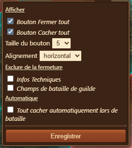

# Fermer toutes les fenêtres


Ce module peut-être activé dans [Paramètres](../parametres/README.md#pop-up)


Le module **Fermer tout** fournit un ensemble pratique de commandes permettant de fermer ou de masquer rapidement plusieurs éléments de l'interface FOE Helper (boîtes contextuelles), rationalisant ainsi l'espace de travail de l'utilisateur et améliorant l'efficacité de la navigation.

## Structure

En mettant la souris sur la fenêtre, s'affiche la partie basse de l'image avec une option de configuration.

La fenêtre peut-être déplacée en cliquant/tenant sur zone marquée "Fermer le..."

Le module **Fermer tout** sera affiché sous la forme d'une petite fenêtre de boîte, qui peut être positionnée selon les préférences du joueur, et est structurée comme suit :
- **Bouton Masquer tout** : Un gros bouton vert comportant une icône en forme d'œil pour masquer tous les modules, y compris le menu d'assistance FOE.
- **Bouton Fermer tout** : Un bouton contrasté avec une icône « X » pour fermer tous les modules.
- [**Configuration**](#configuration) : ouvre les options de configuration pour personnaliser le comportement et l'apparence des boutons. (Disponible en survolant le bouton)

## Configuration

Description de la configuration :
- **Afficher**
  - **Bouton Fermer tout** : Activer ou désactiver la visibilité du bouton "Fermer tout".
  - **Bouton Cacher tout** : Activez ou désactivez la visibilité du bouton "Masquer tout".
- **Taille du bouton** : sélecteur déroulant pour ajuster la taille du bouton (par exemple, valeurs 1 à 5).
- **Alignement de la boîte** : sélecteur déroulant pour choisir l'orientation de l'alignement des boutons (horizontal ou vertical).
- **Exclure de la fermeture** : cases à cocher pour exclure des éléments spécifiques de la fermeture :
  - [Infos Système](../info_technique/README.md)
  - [Champ de bataille de guilde (CbG)](../bataille_guilde/README.md)
- **Automatisation**
  - **Tout cacher automatiquement en bataille** : masque automatiquement toutes les cases lorsqu'un menu de bataille est ouvert.
- **Enregistrer** : bouton pour enregistrer les modifications de configuration.

