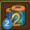
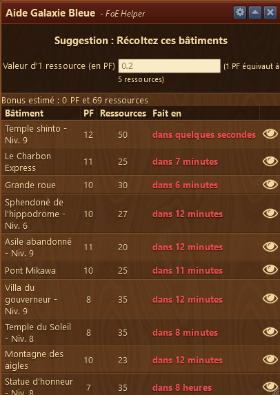
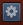
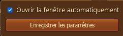
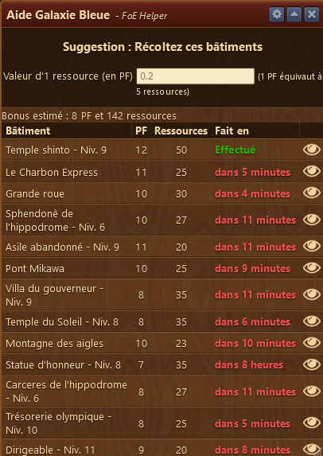
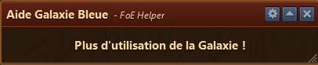

# Assistant Galaxie bleue

L'assistant Galaxie Bleue vous indique quels sont les bâtiments à récolter en premier afin de pouvoir bénéficier de l'effet 2x de la galaxie bleue.

## Structure

L'assistant Galaxie bleue est structuré ainsi :

* La barre de titre avec le menu Configuration à droite 
* Zone d'affichage des bâtiments à récolter

## Configuration

Quand la coche est mise, l'assistant Galaxie bleue s'ouvre automatiquement dès que la galaxie bleue est récoltée.

L'assistant peut être désactivé dans les [paramètres de l'application](../parametres/README.md#galaxie).

## Utilisation

Lorsque vous récoltez la galaxie bleue, l'assistant s'ouvre automatiquement et affiche la liste des bâtiments à récolter.

Les bâtiments prêts à récolter sont affiché en vert et sinon dans combien de minutes / heure la récolte est prête à faire. Pour actualiser les heures de récoltes, vous devez fermer la fenêtre et la ré-ouvrir via l'îcone de la barre de menu .

En cliquant sur l'oeil à droite, vous allez ouvrir l'aperçu de la ville qui vous indiquera où se situe votre bâtiment dans la ville. L'emplacement du bâtiment sera clignotant.

L'assistant se ferme automatiquement dès que la dernière tentative de récolte est faite.

Si on ouvre l'assistant sans qu'aucune tentative soit disponible, l'assistant affiche le message suivant :

