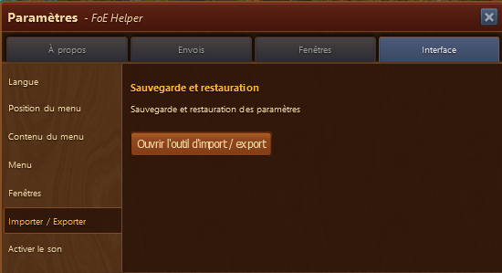
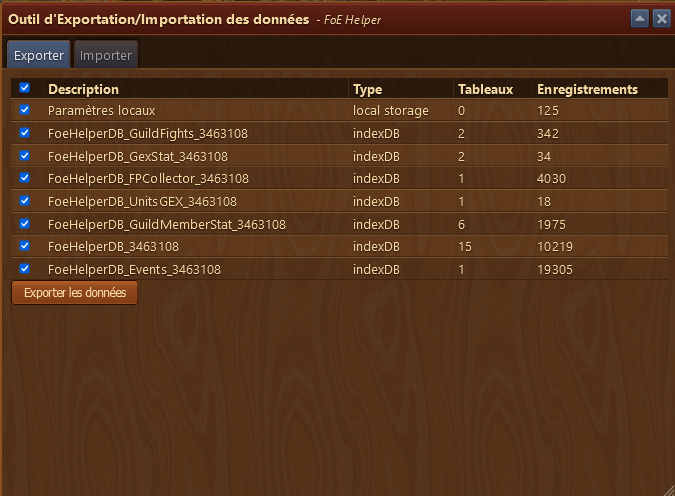
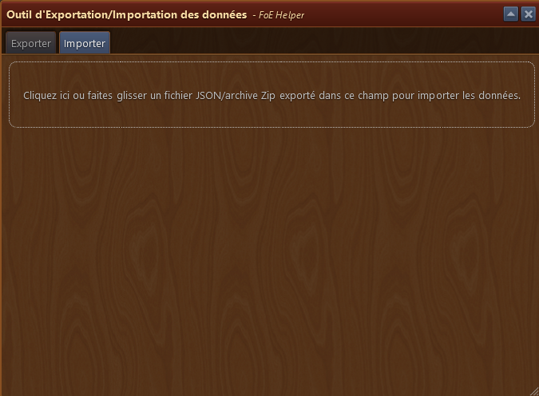
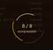
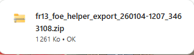

# Outil d'import / Export des données

Le module **Outil d'import / Export des données** vous permet de sauvegarder vos données FoE Helper et de les restaurer sur un autre appareil. Ceci est particulièrement utile lors de la migration de systèmes ou de la synchronisation de configurations entre environnements.

Ce module est accessible via [parametres](../parametres/README.md#autres).

## Structure

 

 La fenêtre est structurée comme suit :
 
 - **Bouton Ouvrir l'outil d'import / export** : Ouvre la fenêtre d'import / export 
 
 
 ### Fenêtre d'import / Export
 
 
 
  La fenêtre est structurée comme suit :
  - Onglet :
	- **Onglet Export** : Permet d'[exporter](#export) les données
	- **Onglet Import** : Permet d'[importer](#import) les données
 
 
 ## Export
 
  
  
   Chaque entrée du tableau comprend :

	- **Description** : courte étiquette expliquant le bloc de données
	- **Type** : méthode de stockage utilisée (par exemple, stockage local, IndexedDB)
	- **Tables** : Nombre de tables internes associées à l'entrée
	- **Enregistrements** : nombre d'enregistrements de données enregistrés
	- **Exporter les données** : Bouton pour exporter les données vers un appareil local.
 
 ## Import
 
 
 
 L'onglet Importer des données est utilisé pour importer des données précédemment enregistrées en cliquant sur le champ d'importation ou en faisant glisser l'archive « .zip » directement dans le champ d'importation.
 
 ## Utilisation
 
- Pour **exporter**, accédez à l'onglet **Exporter** et cliquez sur le bouton Exporter. 
    Un écran est affiché pendant la préparation des données. 
    

  - Un fichier `.zip` contenant vos données enregistrées sera généré et enregistré dans votre dossier **Téléchargements**. 
   
  
 - Pour **importer**, passez à l'onglet **Importer** et sélectionnez un fichier `.zip` précédemment exporté.
  - Cela restaure vos données enregistrées, utiles pour configurer FoE Helper sur un nouvel ordinateur.
 

La restauration des données écrasera vos données actuelles. Importez uniquement des sauvegardes fiables.

  
## FAQ

**Q : Que contient le fichier `.zip` ?** 
R : Il contient des tables exportées depuis votre stockage local et IndexedDB, regroupées pour la récupération.

**Q : Puis-je l'utiliser pour synchroniser deux appareils ?** 
R : Oui, exportez depuis un appareil et importez vers un autre pour répliquer vos paramètres et vos données enregistrées.

**Q : Les données exportées sont-elles lisibles par l'homme ?** 
R : Non, il est structuré pour être réimporté par l'outil FoE Helper et n'est pas destiné à une édition manuelle.

**Q : Cela peut-il restaurer mes paramètres ou mes données de module ?** 
R : Oui, la plupart des configurations et caches spécifiques aux modules sont inclus dans l'exportation. 