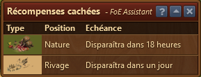

# Incident

 

Ce module affiche les incidents disponibles dans ta ville que tu peux récolter. Il affiche également les reliques disponibles ou encore cachée en Expédition de guilde.

## Structure

Dans le tableau sont affichés quels sont les incidents présents, où l'on peut les trouver et pendant combien de temps.

Le type de relique (commune - argent, inhabituelle - or, rare - jade) est indiqué. 

## Badge sur l'icône

Sur l'icône de la barre d'outils de l'assistant FoE, un nombre superposé indique le nombre d'incident actuellement présents dans votre ville. Si aucun numéro n'est affiché, il n'y a actuellement aucun incident dans votre ville qui peut être récolté. 

## FAQ

**Q : Est-il possible d'afficher le lieu exact d'un événement ?**  
R : Non, malheureusement pas. La position est aléatoire et change avec le temps.

**Q : Est-il possible de lister les événements qui apparaîtront dans le futur ?**  
R : Non, cette fonctionnalité a dû être supprimée. 
