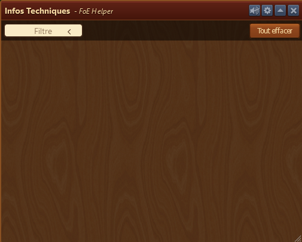
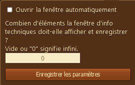
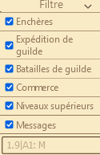
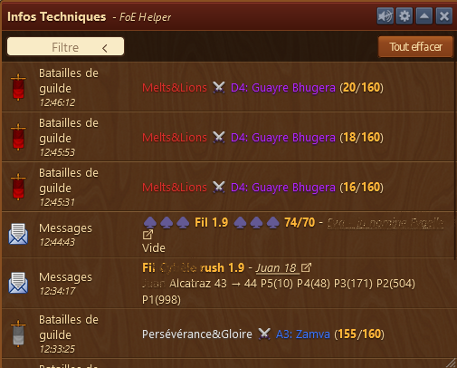
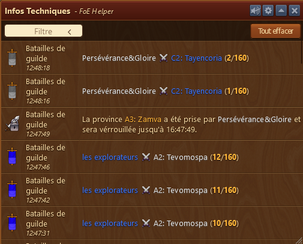

# Info Technique

La fenêtre info technique affiche tous les messages que le jeu génére et permet de filtrer et les voir.

## Structure

La fenêtre est strcturée ainsi de haut en bas :

* La barre de menu avec le bouton pour la configuration 
* Bouton pour effacer tous les messages
* Un menu déroulant pour mettre un filtre
* Zone d'affichage des messages

## Configuration

Le menu configuration permet de 

* Ouvrir la fenêtre automatiquement au chargement du jeu (redondant avec le [menu dans paramètres](../parametres/README.md#inf_tech)
* Nombre de ligne a afficher dans la fenêtre (0 = infini, valeur par défaut)

## Utilisation

### Menu filtre

au moyen des cases à cocher, on peut choisir d'afficher certains genres de message

le champ libre en bas de la fenêtre filtre permet de faire son filtre personnel pour afficher tous les messages qui ont un certain mot par exemple. Au moyen de la barre verticale | vous pouvez chercher 2 mots.

#### Exemples

