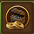
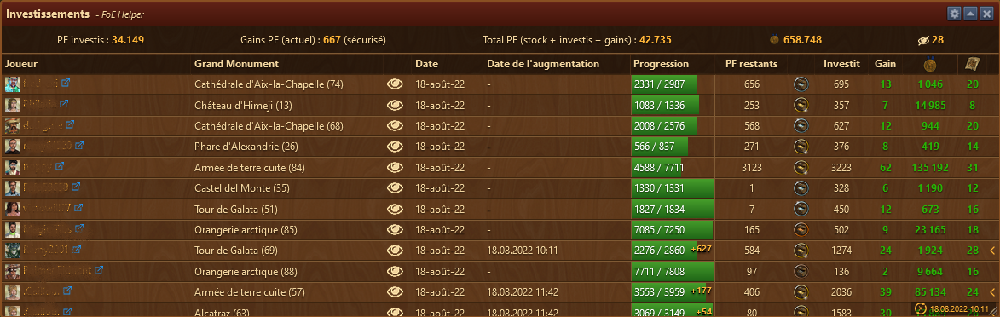
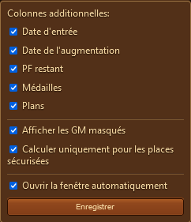
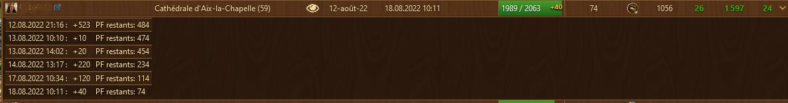
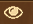
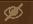

# Investissement PF

Investissement Pf vous montrent vos investissements sur les GM des autres joueurs avec vos gains ou vos pertes éventuelles.

## Structure

L'aperçu de l'investissement PF est structuré comme suit :

* Barre de titre avec le menu Configuration à droite 
* Zone d'affichage des PF investis, gains, stocks
* La zone d'affichage des investissements

## Configuration

Permet de sélectionner l'affichage de certaines colonnes.

L'option "Ouvrir la fenêtre automatiquement" va ouvir cette fenêtre à chaque fois qu'on ouvre l'aperçu des grands Monuments dans l'hôtel de ville.

## Zone d'affichage des PF investis

cette barre affiche :

	* Les PF investis
	* Le gain actuel. si "sécurisé" est inscrit, c'est le gain sans tenir compte des gains des places non sécurisées
	* Le total de vos PF avec votre stock, vos investissements et vos gains
	* Le nombre de médailles que vous allez gagnés
	* Le nombre de GM qui sont [cachés](#cache)

## Zone d'affichage des investissements

Chaque investissment est répertorié, avec si choisi dans la configuration :

	* Date d'investissement
	* Date de l'augmentation
	* Progression des PF sur le GM. Les augmentations depuis la dernière ouverture sont indiquées en jaune
	* Les PF restant à poser
	* Notre place sur le GM
	* Combien on a investi
	* Notre Gain (si le chiffre est en vert) ou notre perte
	* Le nombre de médailles gagnées sur le GM
	* Le nombre de plans gagnés

### Détail des augmentations

En cliquant sur le chevron à droite, on ouvre une vue détaillée des dates / Heures d'augmentation des poses sur le GM.

en recliquant, on referme la vue détaillée.

### Affichage sélectif des GM

en cliquant sur  d'un GM, on peut le cacher dans la liste. Pour autant que l'option de la [configuration](#Configuration) soit sélectionné. Cacher les GM, permet d'afficher que la liste des GM actifs et n'afficher que les GM qui sont montés activement.

Tous les GM affichant ce symbole  ne sont pas pas pris en compte pour le calcul des gains.