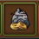
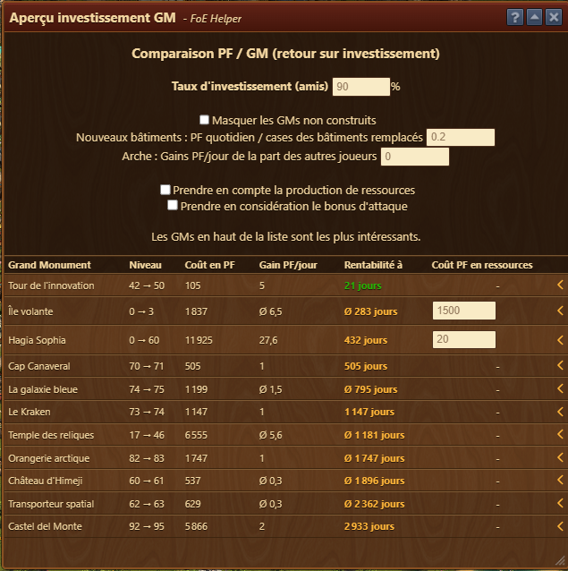

# Assistant Suggestion GM Suivant

 

Compare le ROI (Retour sur investissmenent) en PF des Grands Monuments

## Structure

Les fonctions sont les suivantes

	**Taux d'investissment (amis)** : définissez à quel pourcentage vos amis prendront vos places sur vos GM
	Dessous, vous pouvez masquer les bâtiments que vous n'avez pas construits.
	**Gain PF / Jour** : Ici, vous pouvez entrer soit les valeurs exactes, soit les valeurs moyennes (Carrier, Himeji Castle). Les moyennes sont applicables lors de l'utilisation de toutes les tentatives par jour.
	**Prendre en compte la production de ressource** ouvre des champs pour évaluer combien de PF représentent les gains de ressources
	**Prendre en compte le bonus d'attaque** permet de dire combien de PF réprésente un % supplémentaire d'attaque

Le niveau le moins cher suggéré est affiché dans la première ligne. Il existe également des propositions alternatives

	Niveau : L'augmentation de niveau proposée.
	Coûts : votre propre contribution FP, en tenant compte de la valeur spécifiée dans "Promouvoir avec" et des niveaux à monter.
	Gain / FP journalier : Les deux valeurs avant sont décomposées.
	Rentabilité : la rentabilité en jour
	Coût FP pour les marchandises : Ici, vous pouvez entrer les coûts FP pour toutes les marchandises que vous devez acheter afin qu'elles soient incluses dans le calcul.
 
Dans cet exemple, la tour innovation montée du niveau 42 à 50 serait rentabilisée en 21 jours. En 2e, l'île volante, non constuite, verais ses 3er niveaux rentabilisés en 283 jours.

En ouvrant le chevron à droite, vous voyez la rentabilité des niveaux suivants 

![Rentabilité dès niveau 51 Inno!(./.images/niveau_suivant.png)
