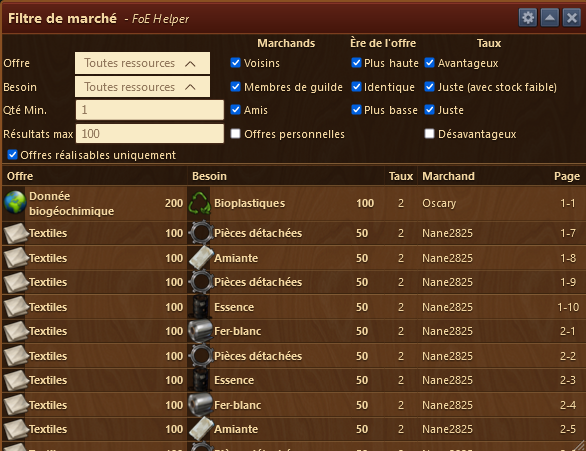
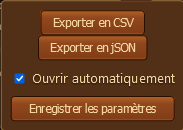
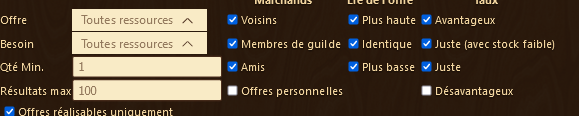
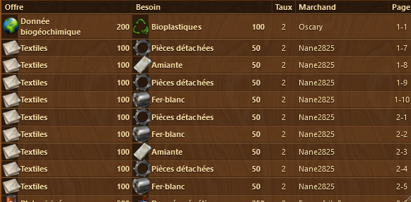

# Filtre du marché

L'assistant filtre du marché vous permet de connaitre à quelle page du Marché, vous allez trouver l'offre qui vous interesse.

## Structure

L'assistant filtre du marché est structuré de la manière suivante de haut en bas :

* La barre de titre avec le menu Configuration 
* Zone de filtre
* Zone d'affichage des offres

## Configuration

Permet d'exporter la liste du marché en CSV ou JSON
Permet que l'assistant s'ouvre automatiquement dès qu'on ouvre le marché. Cette option est redondante avec celle dans les [paramètres](../parametres/README.md#marche)

## Zone de filtre

La zone de filtre pour permet de filtrer au mieux la liste des offres afin d'afficher que les plus pertinentes pour vous.

## Zone d'affichage des offres

A la fin de chaque ligne est indiqué à quelle page et à quelle ligne, vous trouverez l'offre en question. 