# Aperçu des membres de guilde

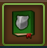

L'aperçu des membres de la guilde vous donne toutes les informations sur les GM des membres, les GM de guilde, le stock de resssource et combien vous pouvez en récolter par jour et les ères de vos membres.

## Structure

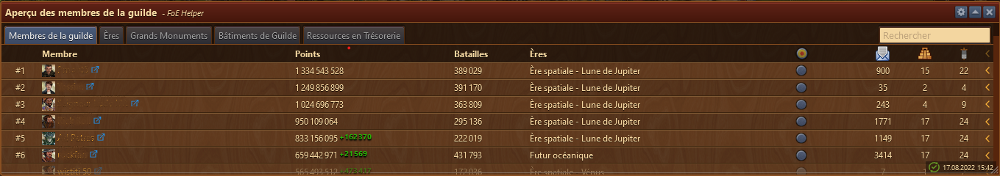

L'aperçu des membres de guildes est structurés comme suit de haut en bas :

* Barre de titre avec le menu Configuration à droite 
* Un champ [recherche](#rechercher_gm) (affichage désactivable dans les paramètres) 
* Onglets des différentes fenêtres d'information
* La zone d'affichage en fonction de l'onglet choisi
* La date / heure de la dernière mise à jour des données 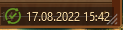

## Configuration

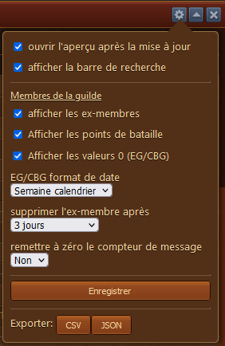


Le bouton Exporter (CSV ou JSON) exporte les données en fonction de l'onglet actif.


Le nom du fichier exporté comporte le nom de l'onglet (en anglais)_la date du jour-l'heure de l'export.

Pour que la fenêtre s'ouvre automatiquement lorsqu'on ouvre Votre Guilde dans le menu Général (FoE) 
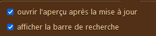 l'option "ouvrir l'aperçu après mise à jour" doit être sélectionnée.

## Les Onglets

### Généralité

* Dans tous les onglets, on peut trier selon la colonne désirée en faisant un clic-droit dessus. Un 2e clic sur le même en-tête permet de faire un tri inversé.
* Les Données sont actualisées si :
	* on a visité les membres de la guilde en cliquant sur leur ville
	* on a visité l'onglet Trésorie de la Guilde dans le menu Général (FoE)
	* on a visité l'onglet Expédition de Guilde 
	* on a ouvert le champd de bataille

Les modifications sont toujours par rapport à la dernière actualisation sur le même PC.

### Membres de la guilde

#### Les points

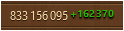 
L'augmentation des points du joueur (depuis la dernière actualisation) est affiché en vert après sont total de points. La diminution de points est affichée en rouge.

#### Départ / arrivée de joueur

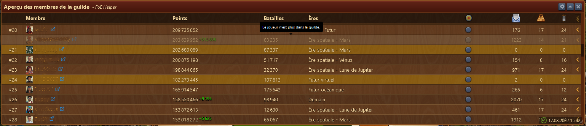

Les membres partis sont affichés avec leur indications tracées et ils n'ont plus de numéro de place dans la guilde. La durée d'affichage peut être réglée dans la [configuration](#Configuration).
 Les nouveaux membres sont affiché avec un fond jaune (jusqu'à la prochaine actualisation).

#### Information sur la participation en EG / CBG

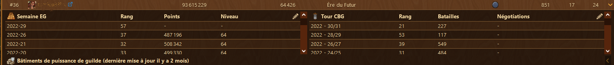

En cliquant sur le petit chevron à la fin d'une ligne d'un membre, on déplie l'affichage des ses résultats en EG / CBG pour toute la durée des données conservées sur le PC.
L'affichage des dates peut être changé dans la [configuration](#Configuration).

Le crayon à droite de négociation ou de Niveau, permet d'effacer l'une ou l'autre semaine de résultat. Un message d'avertissement sera affiché avant de vous donner l'accès à la suppression.

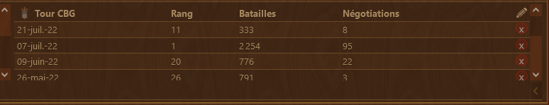 
Un clic sur la croix rouge à droite enlève la ligne de la banque de données. Il n'y pas plus de message de confirmation !

En recliquant sur le chevron, on replie les information pour ce membre.

#### Inactivité

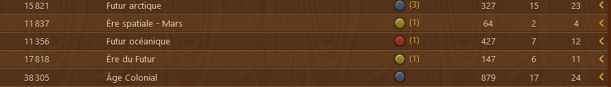

Comme dans FoE, l'inactivité d'un membre est signalée par un bouton de couleur. Jaune pour une absence en cours jusqu'à 3 jours, rouge ensuite. Le chiffre affiché entre parenthèse à coté du bouton de couleur, représente le nombre total de jour d'absence.

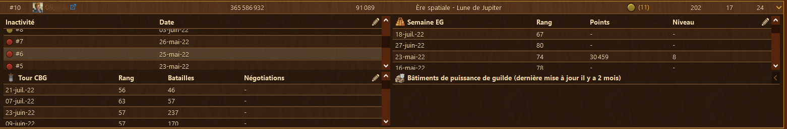
En dépliant les informations de participation à l'EG / CBG, si le membre a des absences, elles seront affichées aussi à cet endroit.

### Ères

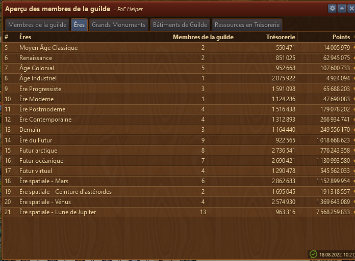

Cette page affiche le nombre de membres par ère. Ainsi que le total de ressources et le nombre de points des membres de la guilde pour cette ère. En cliquant sur le chevron à la fin de la ligne, vous  ouvrez le détail de l'ère.

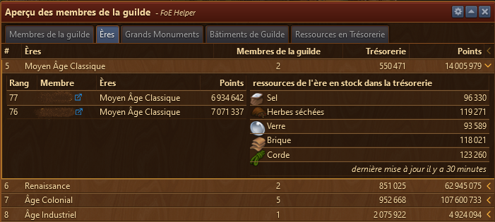

Le détail affiche le nom des membres dans la guilde avec leur points. Ainsi que le stock détaillé des ressources dans la trésorie de guilde.

En recliquant sur le chevron, on replie les information pour cette ère.

### Grands Monuments

#### Aperçu des Grands Monuments

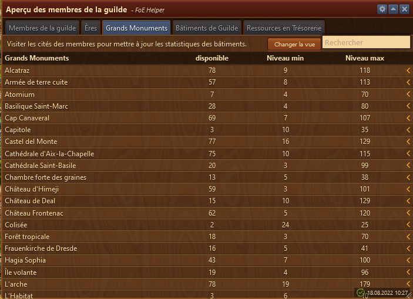

Cette page affiche :

	* (disponible) : le nombre de ce GM dans la guilde
	* (Niveau min) : le plus bas niveau de ce GM
	* (Niveau max) : le plus haut niveau de ce GM

Via le chevron à droite de la ligne, on va afficher [le détail des GM sélectionnés](#detail_GM_ere).

 permet d'afficher la [liste de tous les GM](#liste_GM_ere).

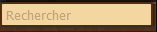 le champ [recherche](#rechercher_gm) permet de rechercher un GM ou un membre.

#### Détail des GM sélectionnés

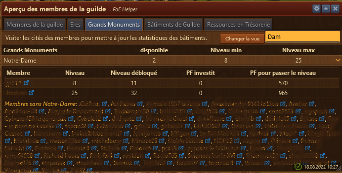

En cliquant sur le chevron, on affiche cette vue qui donne le nom des membres qui ont ce GM, avec les détails :
	* (Niveau) : niveau actuel du GM
	* (Niveau débloqué) : jusqu'à quel niveau le GM est débloqué
	* (PF investit) : combien de PF sont déjà posé sur le GM
	* (PF pour passer le niveau) : combien il manque de PF pour finir le niveau

en bas de la fenêtre est affiché, si c'est le cas, tous les membres qui **n'ont pas** ce GM.

En recliquant sur le chevron, on replie la vue détaillée.

#### Liste de tous les GM

en cliquant sur le bouton **Changer la vue**, on affiche la liste de tous les GM de la guilde.

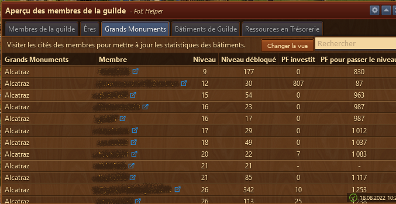

sont affichés aussi les détails :

	* (Niveau) : niveau actuel du GM
	* (Niveau débloqué) : jusqu'à quel niveau le GM est débloqué
	* (PF investit) : combien de PF sont déjà posé sur le GM
	* (PF pour passer le niveau) : combien il manque de PF pour finir le niveau

en recliquant sur le bouton  vous revenez à l'affichage [précédent](#apercu_GM_ere).

#### Champ recherche

le champ **recherche** permet de rechercher soit un GM soit un membre soit les deux. c'est en fonction de l'onglet choisi.

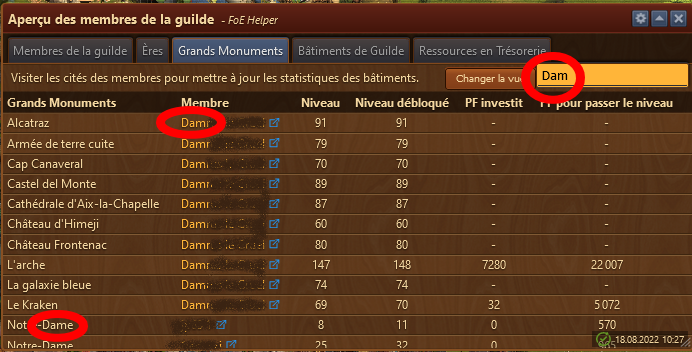

Ici on a recherché 'Dam' dans l'onglet GM avec la vue de tous les GM. Au fur et à mesure que le champ Recherche est modifié, la recherche s'actualise.
La recherche de 'Dam' affiche un membre dont le nom commemnce par Dam, comme les GM qui ont Dam dans le nom.

Le champ ne tient pas compte de la casse et cherche les occurence aussi au milieu du texte.

### Bâtiments de guilde

#### Liste des Bâtiments de guilde

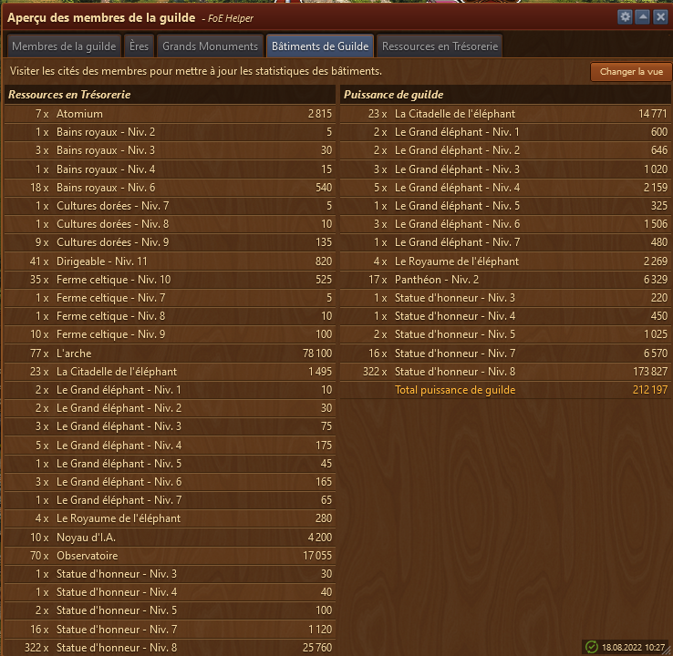

Cette affichage montre le nombre de chaque bâtiments de guilde et le nombre de ressource qu'ils rapportent (si récolté..)
Et affiché aussi la puissance de guilde récoltée chaque jour.

 permet d'afficher la [la vue détaillée des bâtiments de guilde](#liste_GM_guilde).

#### Liste détaillée des GM de guilde

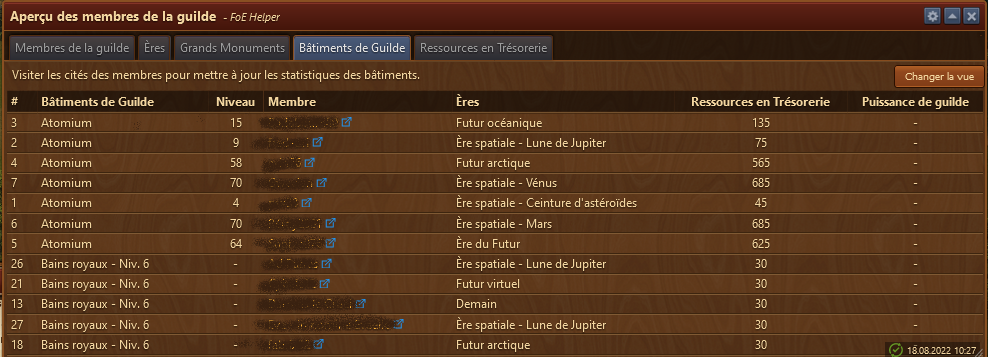

Affiche chaque bâtiment de guilde avec son possesseur. Pour un GM est affiché l'ère du membre et le niveau du GM. Pour un autre bâtiment, l'ère dans laquelle a été construit le bâtiment. S'affiche aussi les ressources et la puissance de guilde rapportées par le bâtiment s'il est récolté.

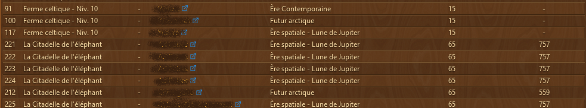 

### Ressources en Trésorie

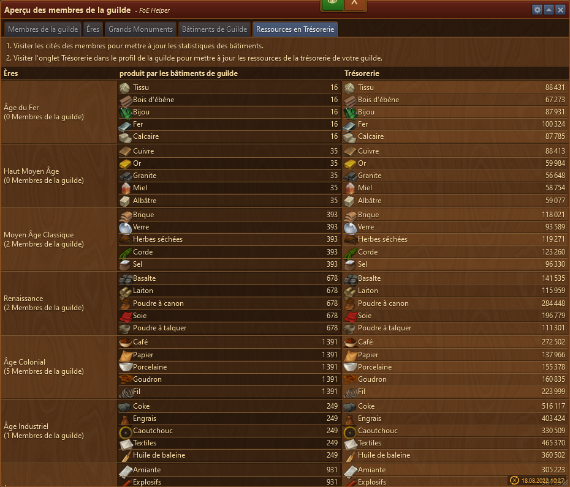

Cette affichage les ressources récoltées par jour par tous les bâtiements de guilde. Indique aussi le nombre de membre dans cette ère et le stock de la trésorie de guilde.
Les informations de la production journalière sont un maximum théorique et dépendant que tous les membres récoltent.