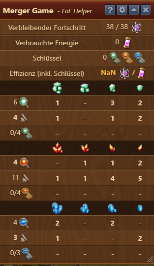
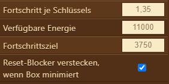

# Info du jeu d'assemblage

Ce module vous montre des informations sur le plateau de jeu d'assemblage lorsque vous ouvrez le mini-jeu de l'événement anniversaire.

## Boîte d'information

the following info s displayed:

les informations suivantes s'affichent :

* combien de progrès peuvent être réalisés sur le plateau actuel en libérant les pièces clés et quels progrès ont déjà été réalisés
* combien d'énergie a déjà été utilisée (y compris les coûts de réinitialisation)
    * au survol de l'énergie, une info-bulle s'affichera, affichant la progression à réaliser sur le tableau actuel pour atteindre l'objectif, en tenant compte de l'énergie actuellement dépensée
* combien de clés ont été combinées (sur le tableau et converties)
* une efficacité (progrès divisé par l'énergie)
* la progression inclut la libération des pièces clés ainsi que les progrès qui peuvent être réalisés lors de l'utilisation ultérieure des clés en achetant des coffres
    * via les paramètres, une valeur cible peut être définie - la couleur de l'efficacité change par rapport à la cible :
        * l'efficacité est rouge lorsqu'elle est inférieure de 5 % ou plus à l'objectif
		* l'efficacité est verte lorsqu'elle est de 15 % ou plus au-dessus de l'objectif
		* l'efficacité est jaune entre les deux, lorsque juste assez de progrès sont réalisés pour atteindre l'objectif
	* au survol de l'efficacité, une infobulle s'affiche, affichant les progrès qui peuvent être réalisés avec cette efficacité, lorsque cette valeur d'efficacité est la même pour tous vos jeux
* un tableau recensant les clés et pièces clés du plateau par couleur et niveau
    * le nombre le plus petit des pièces clés "haut" et "bas" est mis en gras
    * lorsque le nombre maximum de clés est atteint, elles sont mises en gras
    * lorsqu'il y a 2 clés complètes ou plus au niveau 3 (deuxième colonne), elles sont affichées en rouge pour vous rappeler de les combiner avant de les convertir (1 niveau 4 donne 3 clés, tandis que 2 niveaux 3 ne donnent que 2 clés)

De plus, un bloqueur est affiché au-dessus du bouton de réinitialisation tant qu'il y a des clés complètes sur la carte pour empêcher les réinitialisations accidentelles.

## Paramètres

Ce module peut être (dés)activé dans les [parametres](../parametres/README.md#pop-up). ->(Assistants événements).

* progression par clé : c'est la valeur approximative d'une clé (issue de l'achat de coffres - par défaut : 1,3)
* objectif de progression : c'est jusqu'où vous souhaitez aller dans cet événement (par défaut : 3750 pour le kit doré)
* Énergie disponible : cette quantité de monnaie d'événement est disponible au total (par défaut : 11 000 - 10 500 pour les quêtes et ~ 500 pour les incidents)
    * la devise achetée doit être ajoutée ici
* si le bloqueur de réinitialisation ne doit (pas) disparaître lors de la réduction du module, cela peut être défini ici