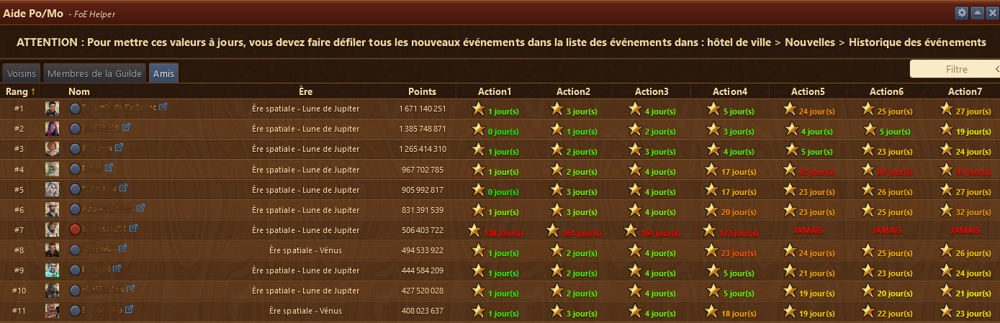
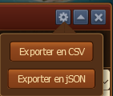
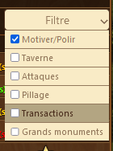
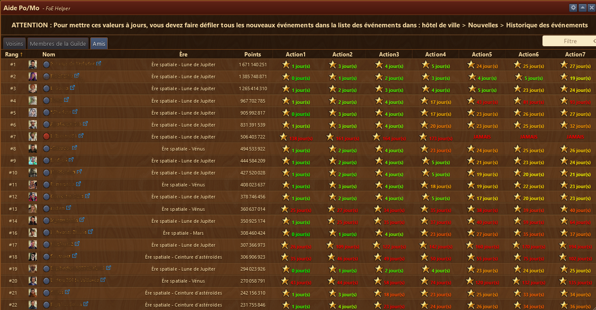
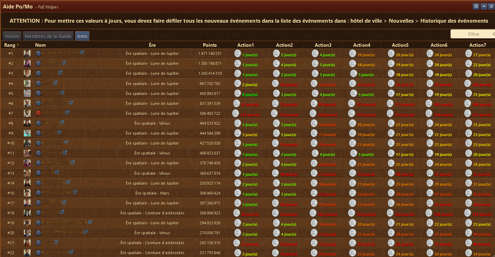
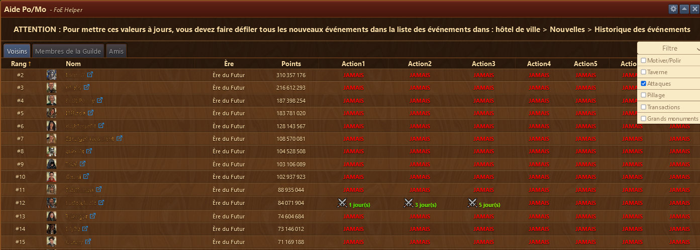
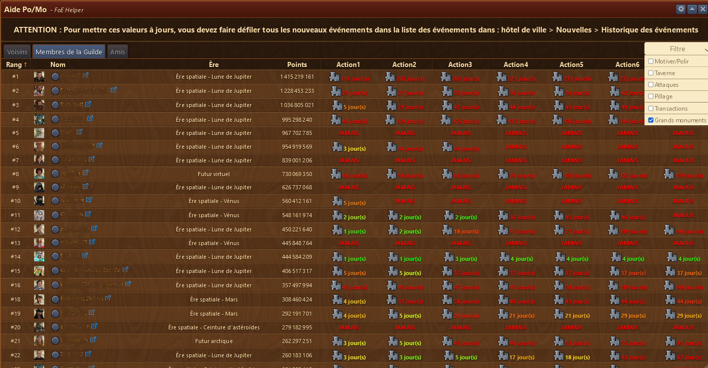

# Polissage et motivation

Ce module permet de voir qui vous motive mais aussi qui vous attaque, vous pille, viens s'asseoir à votre taverne, qui prend vos offres et à qui vous aidez à faire monter les GM.

Pour avoir les infos à jour dans la fenêtre, vous devez passer en revue l'historique des évènements dans l'hôtel de ville


## Structure

L'assistant Po / Mo est structuré ainsi :

* La barre de titre avec le menu Configuration à droite 
* Zone d'affichage des voisins / membres de la guilde / Amis qui ont interragi avec vous

## Configuration

Permet d'exporter les données sous forme de fichier CSV ou JSON. il faut mieux exporter 1 filtre à la fois

## Utilisation

au moyen du filtre à droite, vous pouvez choisir de voir l'interaction que vos voisins, membre de votre guilde ou vos amis ont avec vous.
Sont affichées les 7 dernières interactions avec vous. La coloration des jours indique, comme dans le jeu, le nombre de jour écoulé depuis la dernière interaction. De vert == bon à rouge == mauvais.

La couleur ne fait sens que si l'hôtel de ville est visité chaque jour pour relever ces interactions. Sinon, on peut avoir des effets de passage de rouge à vert comme sur l'image ci-dessous.

Celui qui n'a jamais interagi avec vous aura le mot **jamais** inscrit sous les actions.

### Motiver / polir

L'étoile devant le jour indique le Po / Mo.

### Taverne

La pièce d'argent devant le jour indique qu'il s'est assis dans votre taverne

### Attaque

Les petites épées devant le jour indique une attaque

### Pillage

Indique la dernière fois que vous avez été pillé...

### Transactions

Le symbole ressource devant le jour indique qu'on a pris une de vos offres. Si on vous prend plusieurs offres le même jour, cela sera à chaque fois des actions différentes

### Grands monuments

Le petit château devant le jour indique quand vous avez pris une place sur un GM du joueur.