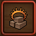
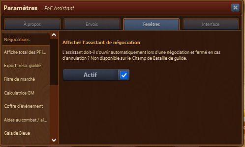
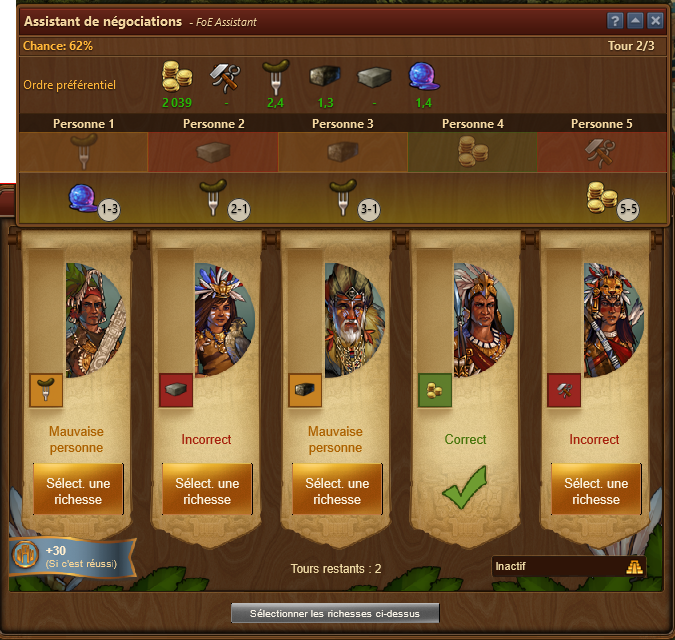
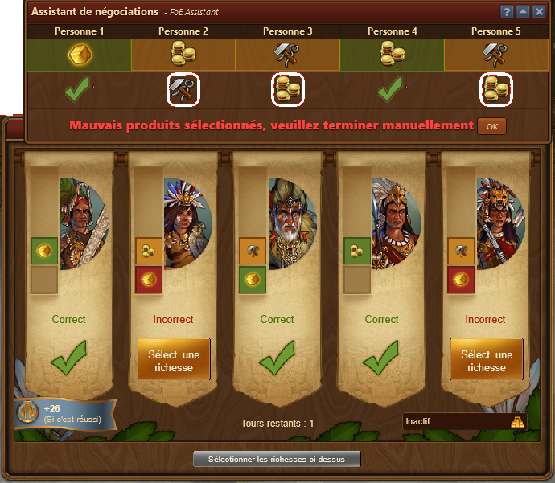

# Assistant de négociation

Les négociations doivent avoir lieu à de nombreux moments du jeu. Parfois simple, parfois complexe. Ce module devrait vous y aider. 

## Structure

La fenêtre affiche les informations et options suivantes :

* **Chance** - Avec quelle probabilité ce tour peut être terminé.
* **Économiser : les ressources de l'ère actuelle** - Si défini, vous indiquez si vos biens actuels doivent être utilisés également pour les suggestions. Sinon, les marchandises de l'époque précédente sont toujours testées en premier. 
* **Les médailles** - si défini, vos médailles seront sauvegardées jusqu'à ce que vous décochez la case. Cela fonctionne très bien, surtout dans les plus petits âges. Cela signifie que ce n'est qu'après que tous les produits ont été testés que les médailles apparaissent. 
* **Tour** - Combien de tours vous pouvez encore jouer. Si vous avez activé un boost de taverne, l'assistant le reconnaît et note 1/4. 
* **Ordre préférentiel** - Les marchandises disponibles pour cette négociation. Vous pouvez utiliser le glisser-déposer pour modifier l'ordre des marchandises avant la première négociation. 

## Configuration

Dans les paramètres, il est possible de spécifier si l'assistant de négociation doit démarrer automatiquement lorsqu'une négociation est lancée. 

## Utilisation

La moitié inférieure de la fenêtre montre les biens que le programme propose de négocier. Si vous avez sélectionné les marchandises et appuyé sur **Payer et négocier**, des suggestions pour le prochain tour s'affichent : 

Les boutons de raccourci pouvant être utilisés sont répertoriés dans les petits cercles sous les suggestions. Par exemple, la troisième colonne de l'image ci-dessus indique **3-1**. Si vous appuyez sur **3**, vous pouvez faire une offre pour la troisième personne. Si vous appuyez ensuite sur **1**, le premier bien, ici Recherche en nutrition, est sélectionné. Ainsi, vous pouvez soumettre les offres très rapidement. Une fois que vous avez sélectionné toutes les offres, vous pouvez appuyer sur la barre d'espace pour les payer. Des détails sur les touches de raccourci dans Forge of Empires sont disponibles sur WIKI - Raccourci clavier (https://fr.wiki.forgeofempires.com/index.php?title=Raccourcis_clavier).

Une fois que vous avez sélectionné et payé un article qui n'a pas été suggéré, un avertissement apparaît vous indiquant que vous devez désormais continuer sans assistance : 

 
 
 ## FAQ
 
**Q : Pourquoi l'assistant de négociation n'est-il pas affiché lors de la négociation dans les batailles de guilde ?**  
R : Le négociateur permet non seulement de mieux négocier, mais aussi plus rapidement. Comme cela affecte l'équilibrage des batailles de guilde, la fonction a été désactivée à ce stade. Dans d'autres lieux (expédition, quêtes, Japon féodal) il demeure. Pour plus de détails, voir Forum discussion FOE Helper (https://discuss.foe-helper.com/d/355-anderungen-am-foe-helfer-changes-to-the-foe-helper) (texte disponible seulement en allemand et anglais) 
