# Assistant Notes

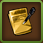

L'assistant Notes vous permet d'enregistrer des notes de manières très flexible.

## Structure

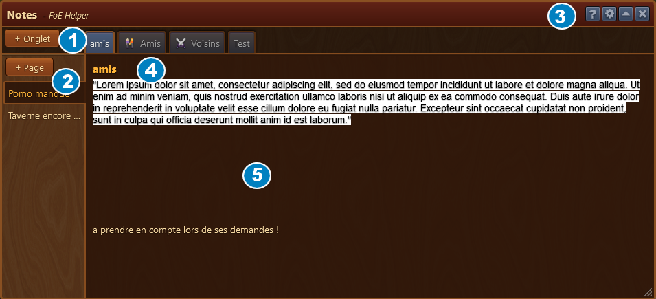

La fenêtre présente des onglets en horizontal et par onglet, des pages en vertical.

Dans la barre de menu, l'icône  vous permet d'éditer le nom de chaque page ou onglet ou de les supprimer.

## Utilisation

### Ajouter un onglet

Le bouton 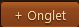 vous permet d'ajouter une nouvel onglet.

une fenêtre s'ouvre :

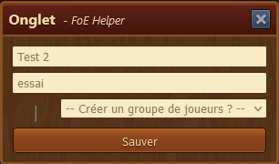

Vous pouvez définir un titre pour votre onglet de manière libre.

Vous pouvez aussi choisir de faire un onglet avec une liste définie des voisins, amis ou membres de la guilde

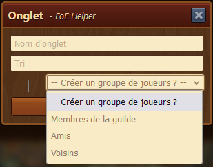

### Ajouter une page 

Le bouton  vous permet d'ajouter une page et de lui donner un nom.

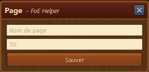

Si vous êtes dans un onglet précédement défini comme une liste de joueur, alors
le bouton est celui-ci : 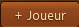

La fenêtre qui s'ouvre vous permet de choisir un joueur :

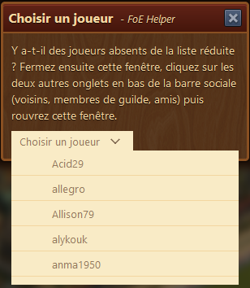

Si vous ne trouvez pas un joueur, vous devez alors visiter vos voisins, membres de guilde ou amis dans
 la barre sociale 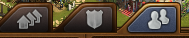 

### Editer / Supprimer une page ou un onglet

Pour éditer une page ou un onglet, ou pour les supprimer, vous devez cliquer sur le bouton  dans la barre de menu.

Un crayon 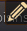 apparait à côté de chaque élément modifiable.

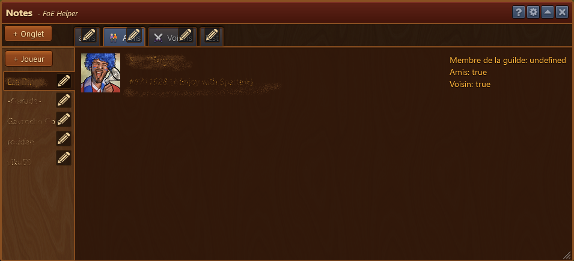

Pour sortir du mode Edition, vous devez re-cliquer sur le bouton 

### Mode Edition

En cliquant sur le crayon , une nouvelle fenêtre s'ouvre 

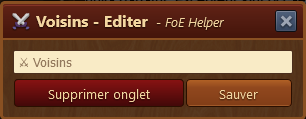

Vous pouvez éditer le titre ou supprimer la page. 

## Ecrire

Pour écrire dans une page, il suffit de cliquer sur la partie centrale de la page et un cadre bleu indique que la page est en mode édition.

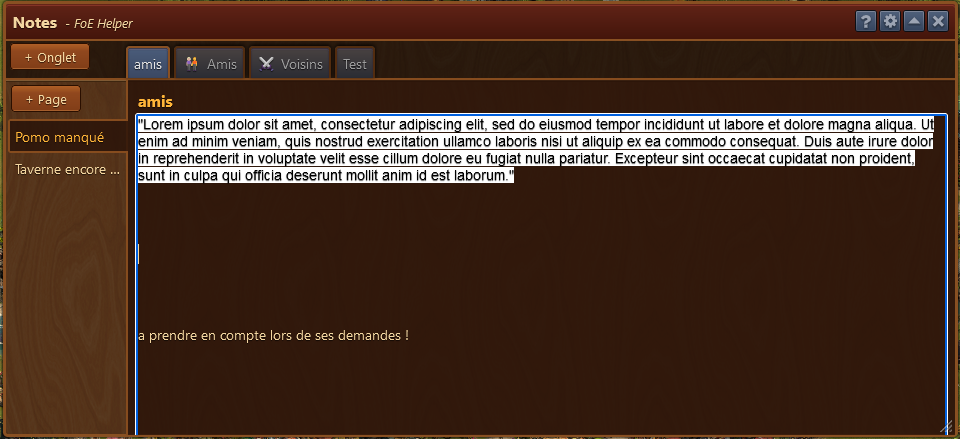

Vous pouvez coller du texte soit formaté soit en texte brut.

Pour sortir du mode Edition de la page, il suffit de cliquer ailleurs sur la page que sur la surface délimitée par le cadre bleu.