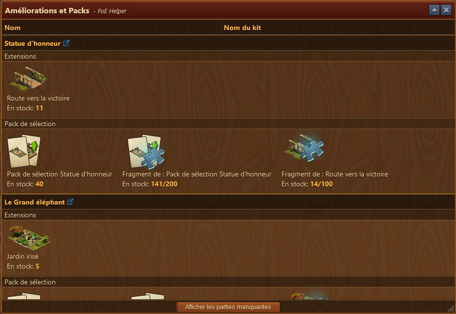
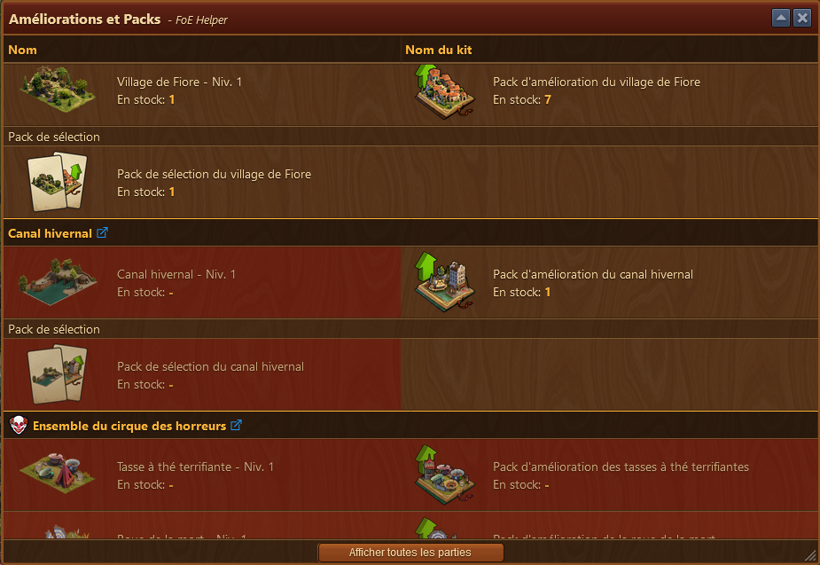

# Assistant Pack

 

L'assistant de Pack vous affiche vos packs et amélioration disponible

## Structure

La fenêtre présente les packs et améliorations disponibles et le nombre de chaque occurence que vous possédez

Si vous avez mis l'option "lien actif" dans les [paramètres de l'assistant](../parametres/README.MD#Lien), le nom des packs est remplacé par un lien vers forgeofempires.fandom.com (en anglais).

le  permet d'afficher ou cacher les packs et améliorations manquantes

Les parties manquantes sont affichées avec un fond rouge.