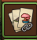
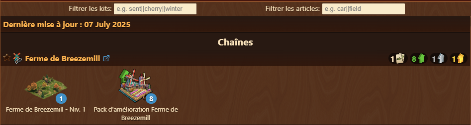
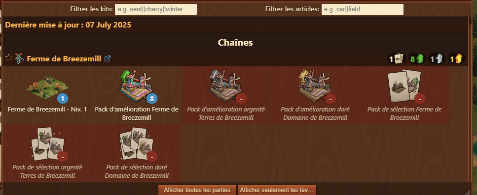

# Assistant Pack

 

L'assistant de Pack vous affiche vos packs et amélioration disponible

## Structure

La fenêtre affiche tous les bâtiments de chaîne disponibles ainsi que la quantité que vous possédez pour chaque article.

Le module ss est structuré comme suit :
1. **Ensembles de filtres** Champ de saisie pour filtrer un ensemble ou une chaîne spécifique
2. **Filtrer les éléments** Champ de saisie pour filtrer un élément spécifique d'un ensemble ou d'une chaîne
3. **Date de la dernière mise à jour** des ensembles et des chaînes
4. **Étoile** Marquage d'une chaîne spécifique ou définie comme favorite
5. **Éléments nécessaires** Aperçu des éléments nécessaires pour le niveau maximum de chaîne et d'ensembles
6. **Masquer les pièces manquantes** Bouton bascule pour changer de vue
    - [Masquer les pièces manquantes](#masquez-les-pièces-manquantes)
    - [Afficher les pièces manquantes](#afficher-les-pièces-manquantes)
    - [Afficher toutes les pièces](#afficher-toutes-les-pièces)
7. **Afficher uniquement les favoris** En sélectionnant, la vue est filtrée sur les ensembles et les chaînes marqués comme favoris

##Configuration

Si vous avez activé l'option **« Afficher les liens »** dans les [paramètres](../parametres/README.md), le nom de chaque chaîne devient un lien cliquable vers sa page correspondante sur le wiki anglais de Forge of Empires (forgeofempires.fandom.com).

## Utilisation

Le module est utilisé pour examiner la chaîne et les ensembles disponibles dans votre inventaire, ainsi que pour obtenir des informations sur tous les éléments nécessaires pour niveler complètement l'ensemble ou la chaîne spécifique.

Les objets que vous ne possédez **pas** actuellement sont affichés sur un fond rouge pour une identification plus facile.

### Masquer les pièces manquantes

Cette vue affiche uniquement les éléments disponibles dans votre inventaire et le nombre de ces éléments.

### Afficher les pièces manquantes

Cette vue affiche les éléments disponibles dans votre inventaire et le nombre de ces éléments, ainsi que les éléments indisponibles de la chaîne ou de l'ensemble observé.


Les objets que vous ne possédez **pas** actuellement sont affichés sur un fond rouge pour une identification plus facile.


### Afficher toutes les pièces

Cette vue affiche tous les ensembles et chaînes, y compris ceux pour lesquels aucun article n'est disponible en inventaire.


Les objets que vous ne possédez **pas** actuellement sont affichés sur un fond rouge pour une identification plus facile.


##FAQ

**Q : Comment puis-je ouvrir un lien vers la page wiki d'un pack spécifique ?** 
R : Activez le paramètre « Lien actif » dans les paramètres de FOE Helper Assistant sous la section Lien. Cela transforme les noms d’éléments en liens cliquables.

**Q : Que signifie le fond rouge ?** 
R : Cela indique des objets ou des améliorations qui ne sont actuellement pas disponibles dans votre inventaire.